# PIR Pipeline Training

This documentation provides a walk-through of the setup and use of the PIR Pipeline. Code samples in the training assume a Windows environment, and the default terminal is assumed to be the Command Prompt (cmd).

## Table of Contents

1. [Pre-installation](#pre-installation)
2. [Installation](#installation)
3. [Package Setup](#package-setup)
4. [Ingesting Data](#ingesting-data)
5. [Linking Questions](#linking-questions)
6. [Using the PIR Pipeline Dashboard](#using-the-pir-pipeline-dashboard)
7. [Managing the PIR Database](#managing-the-pir-database)
8. [Continuing Development](#continuing-development)

## Pre-installation

### Getting Python on PATH

You can confirm whether Python is on PATH by opening a Command Prompt and typing `py --version`:

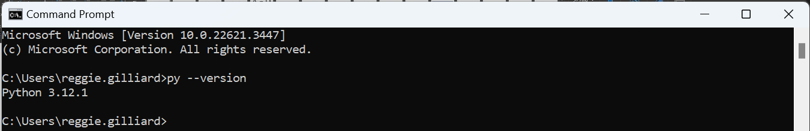

or `where python.exe`:

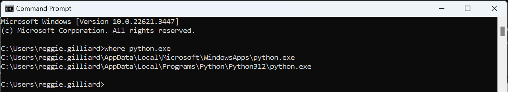

If Python is not on PATH, follow these instructions [for adding python to PATH](https://realpython.com/add-python-to-path/).

### Software Requirements

See [PIR Pipeline Technical Documentation](./technical_documentation.md#software) for software requirements.

### Getting RScript on PATH

The same commands used to confirm whether Python is on PATH can be used to confirm whether RScript is on PATH: `RScript --version` or `where RScript`.

If RScript is not on PATH, apply the instructions for adding Python to PATH for RScript.

## Installation

### Cloning the Repository

Currently the PIR Pipeline is distributed via GitHub. Clone the [ACF-pir-data repository](https://github.com/HHS/ACF-pir-data) to install the pacakge (you can also fork the repository instead). Instructions for cloning repositories are provided at the links below:

- [Cloning a repository using the Command Prompt](https://docs.github.com/en/repositories/creating-and-managing-repositories/cloning-a-repository?tool=webui)
- [Cloning a repository using GitHub Desktop](https://docs.github.com/en/desktop/adding-and-cloning-repositories/cloning-and-forking-repositories-from-github-desktop)

### Creating a Virtual Environment

Once the repository has been cloned, navigate to the directory in which it was cloned and create a virtual environment:

```
cd <repository-directory>
py -m venv venv
```

This will create a `venv` directory into which you will install the PIR Pipeline package.

### Activating the Virtual Environment

It is crucial to activate the virtual environment before installing the package. This prevents conflicts with other Python packages/installations on your computer. To activate, still working in a Command Prompt, type `venv\Scripts\Activate`. (To later deactivate the virtual environment, type `deactivate` in the Command Prompt.) You will know that you've successfully activated the virtual environment if its name appears adjacent to the Command Prompt.

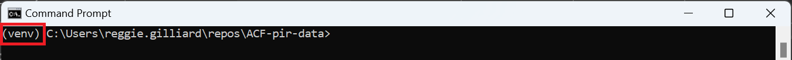

### Install the PIR Pipeline Package

Once the virtual environment is activated, the package can be installed as follows:

```
pip install PIR_Pipeline\dist\pir_pipeline-1.0.0-py3-none-any.whl
```

A slew of messages will be printed to the console. If you see that mysql-connector-python, pir-pipeline, and pywin32 were successfully installed, then installation is complete. (Note that if you are working within a GFE context, you may need to disconnect from the VPN to install the package dependencies.)

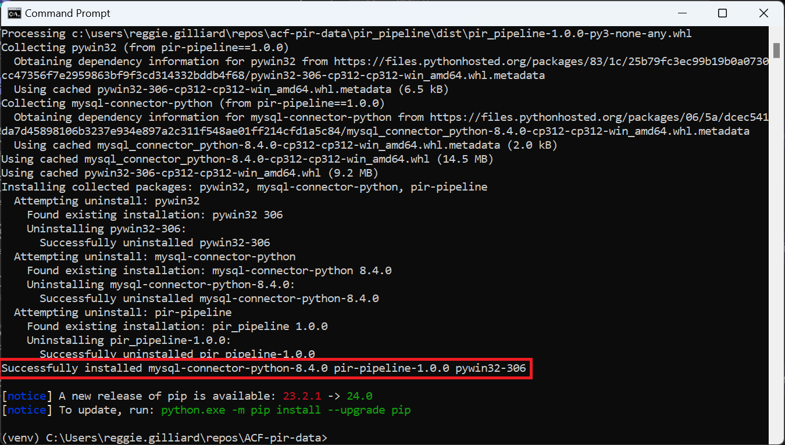

## Package Setup

PIR Pipeline installation requires administrative rights to the target database. It will be helpful to have database credentials on hand before beginning this process.

Still working from the same Command Prompt:

`pir-setup`

A window will appear requesting the directory at which you wish to store PIR data and the path to RScript.exe. The package will try to make recommendations for both of these paths.

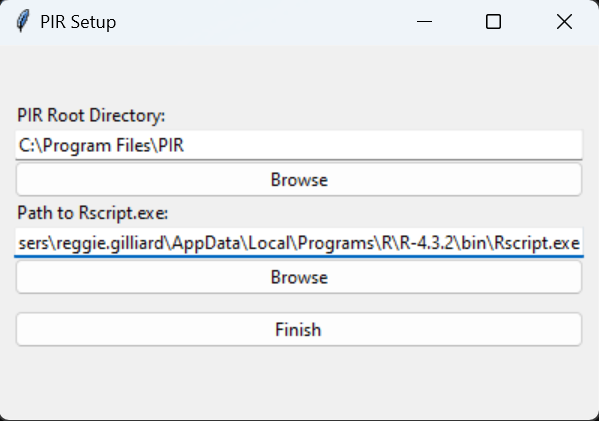

Click `Finish` when ready to move on. Another window will appear requesting database credentials.


Click `Finish` after providing your credentials. This will prompt setup to continue: the configuration file will be generated; the database populated with relevant schemas, views, and stored procedures; and R packages installed.

## Ingesting Data

This section will refer to the directory chosen for the PIR directory structure as *PIR*.

### Storing Raw Data

Raw data should be stored in *PIR\PIR_data_repository\Raw*. This is the only folder in *PIR\PIR_data_repository* that you need to manage. *PIR\PIR_data_repository\Unprocessed* will contain any files that were not processed due to incorrect file types. After a successful ingestion, files will be copied from *PIR\PIR_data_repository\Raw*, given a timestamp, and moved to *PIR\PIR_data_repository\Processed*. For the purposes of this training, test data is provided in the PIR Pipeline package. Move this test data to *PIR\PIR_data_repository\Raw* to get started with ingestion:

```
copy venv\Lib\site-packages\pir_pipeline\test_data\* PIR\PIR_data_repository\Raw
```

### Triggering Ingestion

The command `pir-ingest` can be used to ingest data. By default running `pir-ingest` schedules all files currently in the raw folder for ingestion. Running the command:

`pir-ingest`

We can confirm that the task was scheduled by checking the task scheduler.

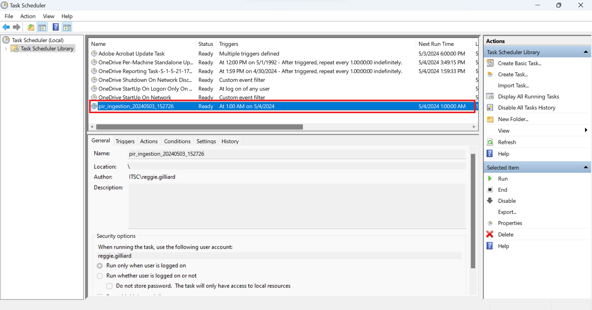

There will be a corresponding batch file in the *PIR\Listener_bats* directory as well.

If instead immediate ingestion is desired, `pir-ingest` has a few options:

- `--now`: Immediately trigger ingestion.
- `--files`: Combine with `--now` to trigger immediate ingestion only for specific files (note that you must specify the absolute path to the file). 

Using the test data:

`pir-ingest --now --files "<full-path-to-files>\PIR\PIR_data_repository\Raw\pir_export_2019.xlsx"`

Checking *PIR\PIR_data_repository\Raw* will reveal that only the target file was ingested.

Ingest the remaining files with: 

`pir-ingest --now`

### Verifying Ingestion Success

The PIR pipeline package provides a command line facility for checking the latest logs in pir_logs.pir_ingestion_logs:

```
pir-status --ingestion
```

This returns JSON formatted log output:

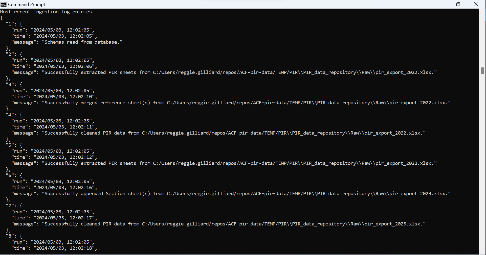

#### Reviewing Logs

Alternatively, one can open MySQL from the command line or via MySQL Workbench and review the pir_ingestion_logs in this way.

*Only the most recent logs*
```
SELECT *
FROM pir_logs.pir_ingestion_logs
WHERE run = (
  SELECT max(run)
  FROM pir_logs.pir_ingestion_logs
);
```

*All logs*
```
SELECT *
FROM pir_logs.pir_ingestion_logs;
```

## Linking Questions

### Question Linking Algorithm

#### Base Linking Algorithm

When question linking is triggered, the script begins by identifying the most recent year available and initially treating all questions as questions to match (QTM).

First, the algorithm searches for direct matches on question_id in either the pir_question_links.linked or pir_question_links.unlinked tables. Questions with identical question_id are assumed to be the same across years. Such questions are removed from QTM and prepared for insertion into pir_question_links.linked. If any of these questions matched with a question in pir_question_links.unlinked, that question is also prepared for insertion into pir_question_links.linked (and removed from pir_question_links.unlinked).

An attempt is then made to match the remaining questions in QTM to those in pir_question_links.linked using a string distance algorithm. The string distance between the question_name, question_number, section, and question_text of each question in QTM and each question in pir_question_links.linked is calculated using a variation of the (Levenshtein distance)[https://en.wikipedia.org/wiki/Levenshtein_distance]. Matches must come from the same section: a question in Section A cannot be linked to a question in Section B. Two questions are considered linked when two of the remaining three string distances are equal to 0. That is, if question_name_dist and question_text_dist are both 0 then the two questions are linked and so on for the other possible two-choice combinations of question_name, question_number, and question_text. Any questions linked in this way are also removed from QTM and added to the data frame being prepared for insertion into pir_question_links.linked.

The same approach is used to determine whether there are links between the questions remaining in QTM and any questions in the pir_question_links.unlinked table. When all potential links have been made, linked questions are inserted into pir_question_links.linked and unlinked questions from QTM are inserted into pir_question_links.unlinked.

#### Ad-hoc Links

Through review of the linked and unlinked questions, the PIR Pipeline team identified a set of questions which we believe are missed by the base linking algorithm. These manually curated links, which we call ad-hoc links, are made during the standard linking process, but they are tracked in the pir_logs.pir_manual_question_link table for easy link review and destruction.

There are two sources of ad-hoc links: 1) adHocLinks.R and 2) ad_hoc_links.RDS. In adHocLinks.R are systematic linkages: cases in which entire series of questions are renamed to resemble questions in other years. ad_hoc_links.RDS contains a handful of links that cannot be systematized. Ad-hoc links can be updated by modifying either the R script or .RDS file.

#### Dashboard Linking

The PIR dashboard enables review of unlinked questions. In addition to presenting a list of proposed links for a given unlinked question as produced by the base matching algorithm detailed above, we also present a list of proposed links employing the [weighted Jaccard algorithm](https://cran.r-project.org/web/packages/fedmatch/vignettes/Fuzzy-matching.html#Weighted%20Jaccard%20Similarity). This presents reviewers with a broader range of potential matches to review. We recommend beginning by reviewing the Jaccard matches for questions of interest.

### Triggering Question Linking

Continuing in the Command Prompt:

```
pir-link
```

Will link questions from the data ingested earlier.

### Verifying Linking Success

As with ingestion, `pir-status --link` can be used for checking the latest logs in pir_logs.pir_question_linkage_logs:

```
pir-status --link
```

The output will resemble the output from `pir-status --ingestion`.

#### Reviewing Logs

Again, one can open MySQL from the command line or via MySQL Workbench and review the pir_question_linkage_logs in this way.

*Only the most recent logs*
```
SELECT *
FROM pir_logs.pir_question_linkage_logs
WHERE run = (
  SELECT max(run)
  FROM pir_logs.pir_question_linkage_logs
);
```

*All logs*
```
SELECT *
FROM pir_logs.pir_question_linkage_logs;
```

#### Reviewing Tables

One can also perform quick sanity checks such as confirming that the expected years are in the linked table

```
SELECT distinct(year)
FROM pir_question_links.linked;
```

or confirming that there is no overlap between linked and unlinked.

```
SELECT distinct(linked.question_id)
FROM pir_question_links.linked
INNER JOIN pir_question_links.unlinked
ON pir_question_links.linked.question_id = pir_question_links.unlinked.question_id;
```

## Using the PIR Pipeline Dashboard

### Launching the Dashboard

Continuing in the Command Prompt:

```
pir-dashboard
```

will launch the dashboard, which will be hosted locally on your computer. Some dialogue will print to the console culminating in something like:

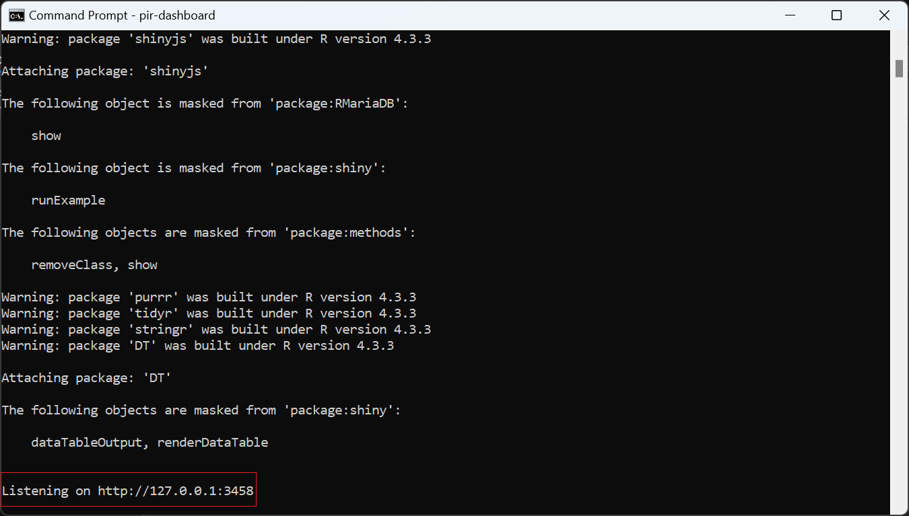

. The dashboard will launch in your default web browser.

### Navigating Dashboard Tabs

#### Question Link Overview

Upon launching the dashboard users are presented with the Overview tab. Here, the latest result for each of the listener, ingestion, and question linkage logs is presented. An additional table, displaying the count of questions that are linked/unlinked is also included here.

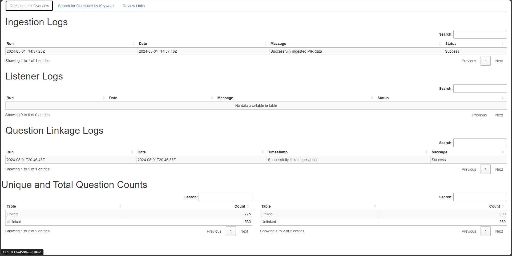

#### Search for Questions by Keyword

The second tab of the dashboard enables users to search for questions in the pir_question_links database by keyword(s). In the PIR database, all questions are identified by a *question_id* which is a hashed version of their *question_name* and *question_number*. These IDs are useful for storing the data, but not particularly meaningful to humans. This tab can help users get from a question name, number, or bits of question text to *question_id*s.

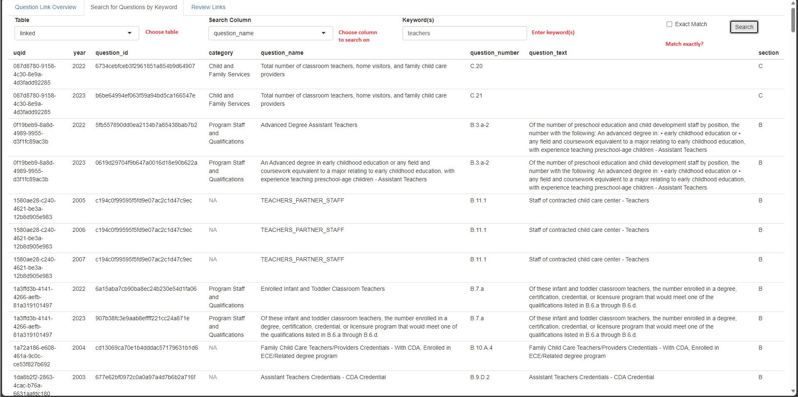

This tab is calling the [keywordSearch](../src/pir_pipeline/pir_sql/pir_question_links/StoredProcedures/keywordSearch.sql) stored procedure to render the tables presented in the dashboard.

#### Review Links

This tab, composed of three sub-tabs, is the heart of the PIR Pipeline Dashboard. Each of the three sub-tabs corresponds to one of the three scenarios under which questions might warrant review: **Review Unlinked** enables review of unlinked questions; **Review Intermittent Links** allows users to review questions that are not linked for the entirety of the period for which users have PIR data; **Review Inconsistent Links** enables users to review questions which link to different *question_id*s over time, and break those links as necessary.

##### Review Unlinked

This tab presents all of the questions in the *pir_question_links.unlinked* table and potential matches for them. The proposed matches are generated by two algorithms: the base PIR matching algorithm, 
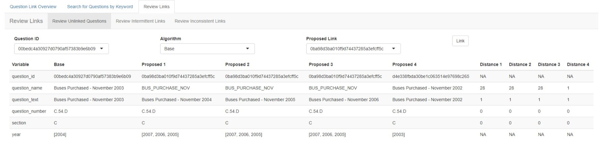
and the Weighted Jaccard algorithm proposed by the authors of the *fedmatch* package. 
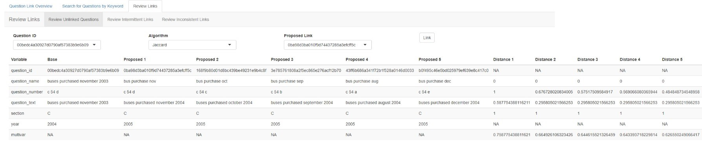 
(See [Linking Questions](#linking-questions) for further details about these algorithms).

Base matches are constructed during the linking process and are stored in the *proposed_link* column of the *pir_question_links.unlinked* table.

Jaccard matches are constructed using the [jaccardUnlinked](../src/pir_pipeline/pir_question_links/utils/jaccardUnlinked.R) function and links are created using the [genLink](../src/pir_pipeline/pir_question_links/utils/genLink.R) function.

##### Review Intermittent Links

This tab presents all questions that are linked during some subset of the period for which the user has PIR data. For example, if the user has ingested data for 2018-2023, but a question is only linked for the years 2021-2023, that question will appear in this tab.

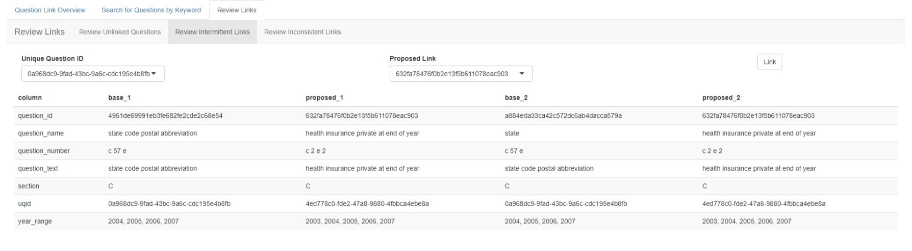

The list of questions with intermittent links is acquired from the *pir_question_links.imperfect_link_v* view. Proposed matches are generated using the [jaccardIDMatch](../src/pir_pipeline/pir_question_links/utils/jaccardIDMatch.R) function and links are created using the [genIntermittentLink](../src/pir_pipeline/pir_question_links/utils/genIntermittentLink.R) function.

##### Review Inconsistent Links

This tab presents all questions that are linked to multiple *question_id*s over time. For example, if a question with ID A is linked to a question with ID B, this question will appear in this tab.

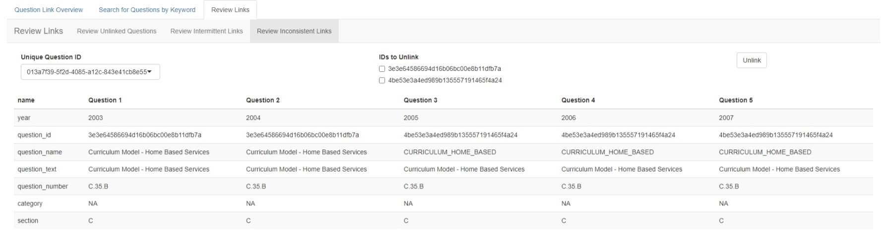

The list of questions with inconsistent IDs is acquired from the *pir_question_links.imperfect_link_v* view. The table shown in the tab, which lists the offending question and all of its extant links, is created by the [inconsistentIDMatch](../src/pir_pipeline/pir_question_links/utils/inconsistentIDMatch.R) function. The [deleteLink](../src/pir_pipeline/pir_question_links/utils/deleteLink.R) function is used to destroy links.

### Closing the Dashboard

To close the dashboard, simply click the *Shutdown* tab.

### Example Question Review

Continuing in the Command Prompt, begin by starting the dashboard:

```
pir-dashboard
```

Note the count of linked and unlinked questions initially:


And navigate to the **Review Links** tab. Scanning through the unlinked questions, we come to ID "06dae44fe183c592f4134a8cfc6d37c8". Looking across the matches proposed by the base algorithm, nothing appears to be a good fit

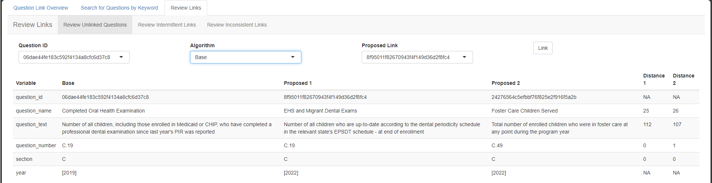

But switching to the Jaccard algorithm, reveals that ID "d4b37412954e4da887413fd85d280715" is quite a close match.

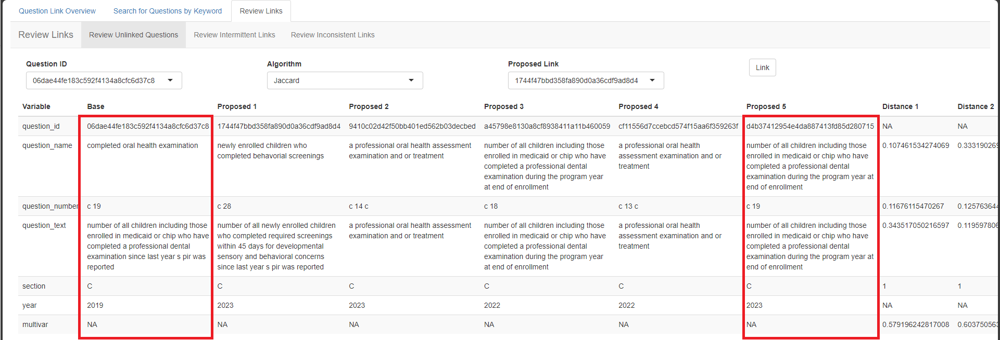
To proceed with linking, click the `Link` button. After linking, the tab will reset the "question_id" to blank like so:

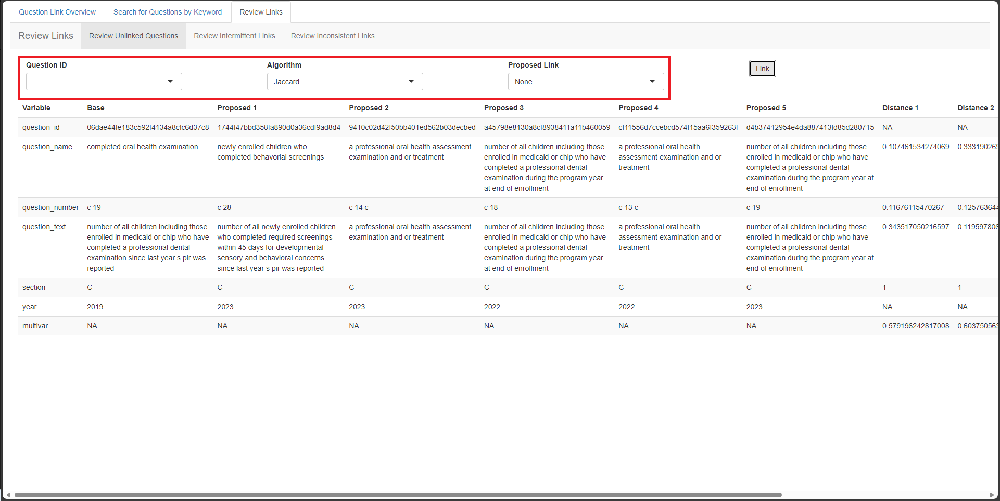

And the next time the dashboard is loaded, the count of questions will be updated to reflect the change. You can also check the linked table for the ID you just linked to confirm that the record has been moved from unlinked to linked.

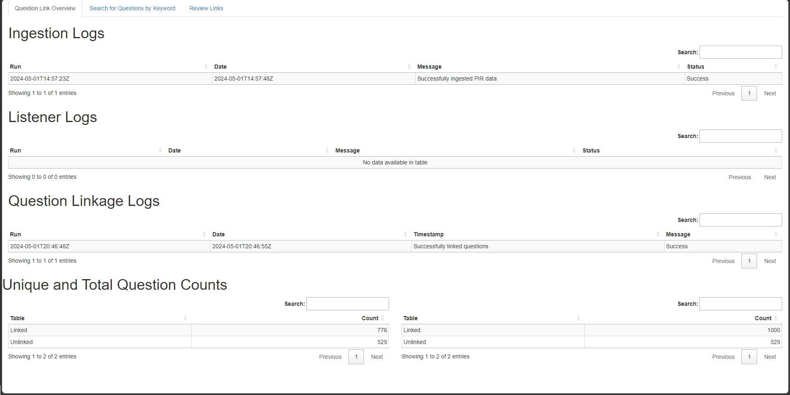

Or confirm by checking the *Search for Questions by Keyword* tab

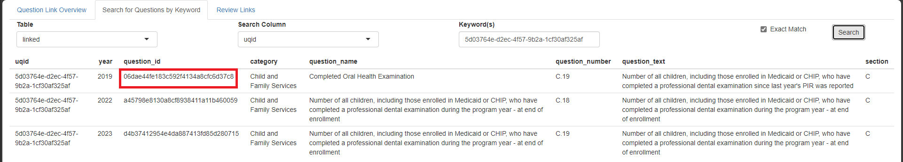

Now, suppose upon further review you decide that IDs "06dae44fe183c592f4134a8cfc6d37c8" and "d4b37412954e4da887413fd85d280715" should not actually be linked. In that case, navigate to the *Search for Questions by Keyword* tab and search the linked table for either ID to get the associated uqid:

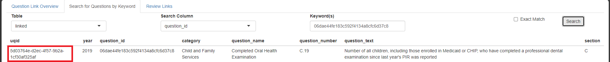

Find this question in the *Review Inconsistent Links* tab:

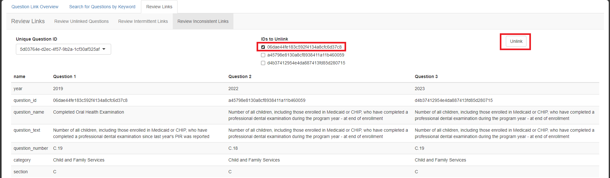

Clicking `Unlink` will send "06dae44fe183c592f4134a8cfc6d37c8" back to the unlinked table. You can confirm this by checking the *Search for Questions by Keyword* or *Question Link Overview* tabs again.

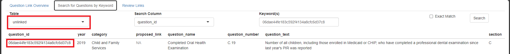

## Managing the PIR Database

This section of the training can be done either in the Command Prompt, or in MySQL Workbench. To continue in the Command Prompt:

```
mysql -u <your-username> -p
```

You will be prompted for your password. Enter it, and then press enter again to sign in to MySQL.

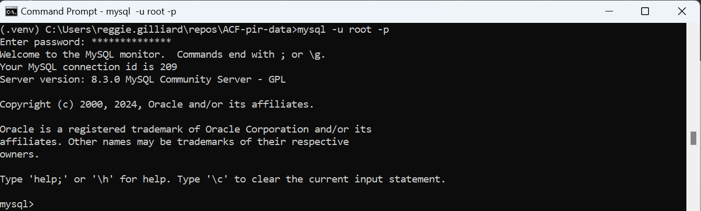

### PIR Database Entity Relationship Diagram

#### PIR Data

```
use pir_data;
```

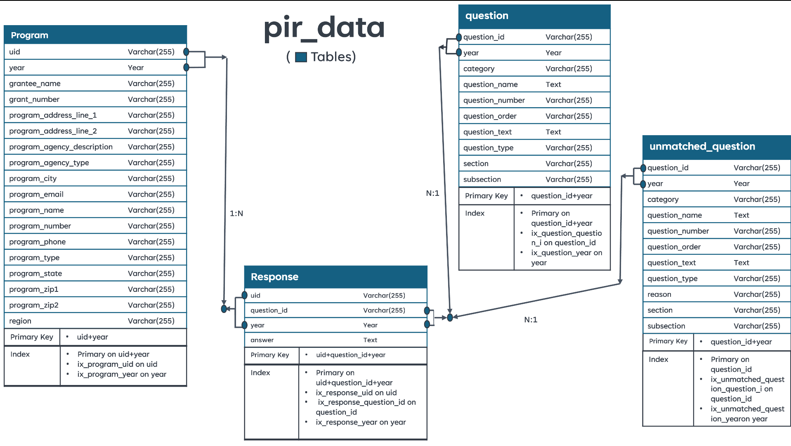

There are four tables in the *pir_data* schema: response, program, question, and unmatched_question. The key table here is the response table, this is where the responses to the PIR survey are stored. The program and question tables contain meta-data and can be linked to the response table n:1 using the combination of year and either uid or question_id respectively. For example:

```
SELECT *
FROM response
LEFT JOIN question
ON response.question_id = question.question_id and response.`year` = question.`year`
LIMIT 10;
```
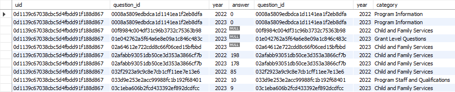

*OR*

```
SELECT *
FROM response
LEFT JOIN program
ON response.uid = program.uid and response.`year` = program.`year`
LIMIT 10;
```

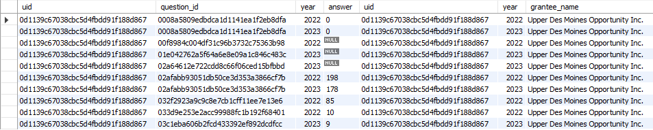

The question table contains all of the information in the unmatched_question table, except for the reason that a question is considered unmatched. Given this, we will forego further discussion of the unmatched_question table in this training.

#### PIR Question Links

```
use pir_question_links;
```

##### Tables

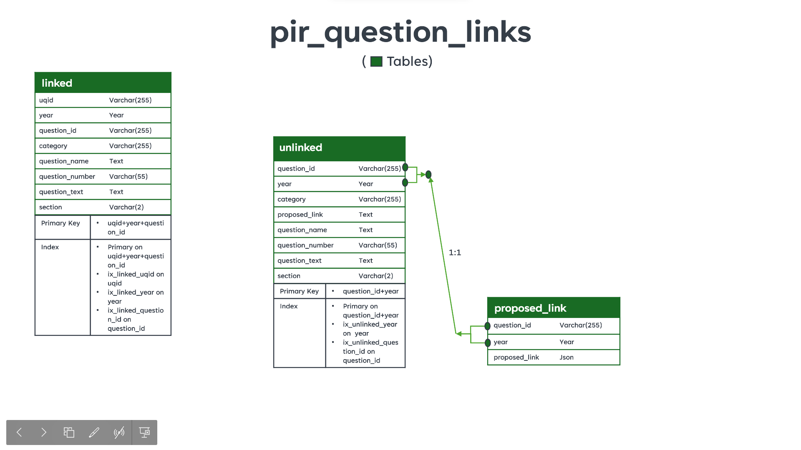

There are three tables in the *pir_question_links* schema: *linked*, *unlinked*, and *proposed_link*. The *linked* table contains all questions that have been linked across any length of time, the *unlinked* table contains questions that are never linked across time. The *proposed_link* table is derived from the unlinked table and is simply a truncated version.

*Linked* and *unlinked* are the tables that will be queried directly most often. *Linked* is unique in that there are two IDs for each question: 1) question_id, the same unique identifier used in *pir_data.response* and *pir_data.question* to uniquely identify questions (within a year); 2) uqid (unique question ID) which is an identifier unique to *linked* that can identify questions across time. Questions sharing a uqid do not need to share a question_id. Two available IDs means *linked* can be queried on ID in two ways:

```
SELECT *
FROM linked
WHERE uqid = "01fbd4fe-3a59-4016-8f83-6a727c58dda4"; -- NOTE THAT THIS uqid WILL CHANGE
```

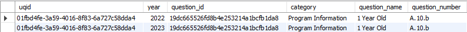

OR

```
SELECT *
FROM linked
WHERE question_id = "19dc665526fd8b4e253214a1bcfb1da8";
```

which yields an identical result to that shown in the figure above. (Notice that the question_id is "19dc665526fd8b4e253214a1bcfb1da8" for both questions).

*unlinked* only has the single ID, question_id, to query on:

```
SELECT *
FROM unlinked
WHERE question_id = "184047b683ff56a3dc38c71d15f785cb";
```

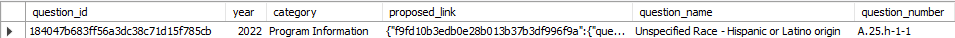

##### Views

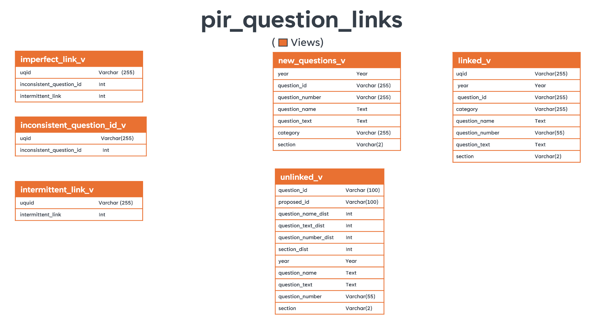

There are six views in the *pir_question_links* schema:

- *imperfect_link_v* - A view combining the inconsistent_question_id_v and intermittent_link_v views.
- *inconsistent_question_id_v* - A view displaying all questions that are linked, but question_id varies within uqid.
- *intermittent_link_v* - A view displaying all questions that are linked, but do not cover the full period of years available.
- *linked_v* - A view of the linked table.
- *new_questions_v* - Contains questions that appear for the first time in any given year.
- *unlinked_v* - A view of the unlinked table where proposed_link has been unpacked.

As the descriptions suggest, *intermittent_link_v* and *inconsistent_question_id_v* are components of the table *imperfect_link_v*. Each of these views is unique by uqid. Query any of them as follows:

```
SELECT *
FROM imperfect_link_v
WHERE uqid = "02ac5893-df25-40e8-85d7-606d4e8d971b"; -- NOTE THAT THIS uqid WILL CHANGE
```

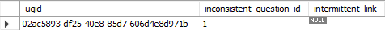

*linked_question_v* is a direct view onto the *linked* table. This view, therefore, can be queried in the same ways that *linked* can.

*new_questions_v* is similar, in that it essentially contains the information that is in the *pir_data.question* table. It is useful in that it can be used to ascertain the first year in which a given question_id appeared. Query it as you would *pir_data.question*:

```
SELECT *
FROM new_questions_v
WHERE question_id = "19dc665526fd8b4e253214a1bcfb1da8";
```

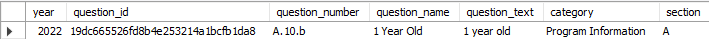

Finally, *unlinked_v* is similar to the *unlinked* table. For the view version of unlinked, some columns have been removed and the proposed_link column has been unpacked such that there can be more than one row per unlinked question_id. This also yields new columns which give the distances calculated by the [base matching algorithm](#base-linking-algorithm). Query it as you would *unlinked*:

```
SELECT *
FROM unlinked_v
WHERE question_id = "184047b683ff56a3dc38c71d15f785cb";
```

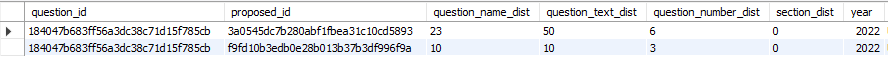

#### PIR Logs


The *pir_logs* schema consists of 4 tables:

-   *pir_ingestion_logs* - Contains ingestion logs.
-   *pir_question_linkage_logs* - Contains question linkage logs.
-   *pir_listener_logs* - Contains logs for the listener/scheduled
    ingestions.
-   *pir_manual_question_link* - Contains logs of manual question
    links.
    
In general, querying these tables is unnecessary. The most common reason to query the logs is to see the result of the latest round of ingestion or question linking. This topic is addressed in the [verifying success](#verifying-success) section of Linking Questions.

### Intra-schema Queries

The *pir_data* and *pir_question_links* schema share some key variables. In particular, *question_id* is in several tables across both schemata. This makes writing queries across the two schemata simple. Suppose one wants to get all responses associated with a question over time. This requires using *pir_question_links.linked* (in case the question_id changes over time) as well as *pir_data.response*. If uqid is known, the following query will get all responses:

```
WITH
distinct_qid AS (
  SELECT DISTINCT question_id
  FROM pir_question_links.linked b
  WHERE uqid = "02ac5893-df25-40e8-85d7-606d4e8d971b"
) 
SELECT response.*
FROM response
INNER JOIN distinct_qid
ON response.question_id = distinct_qid.question_id;
```

OR

```
WITH
distinct_uqid AS (
	SELECT DISTINCT uqid
	FROM pir_question_links.linked
	WHERE question_id = '4204a9701b894bb9ecd39865c6b30cc8'
),
distinct_qid AS (
	SELECT DISTINCT question_id
	FROM pir_question_links.linked
	INNER JOIN distinct_uqid
	ON pir_question_links.linked.uqid = distinct_uqid.uqid
)
SELECT response.*
FROM response
INNER JOIN distinct_qid
ON response.question_id = distinct_qid.question_id;
```

which both yield :

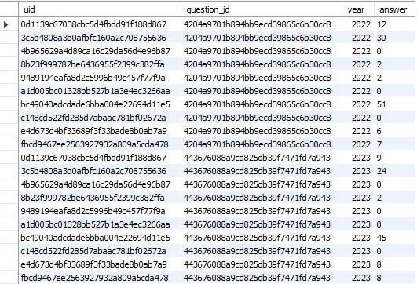

### Using Stored Procedures

To this point we have written many queries, some of which have been relatively complex. Stored procedures make it possible to store such queries for later use and to make them dynamic. Consider the two queries above. The procedure [*pir_data.getQuestion*](../src/pir_pipeline/pir_sql/pir_data/StoredProcedures/getQuestion.sql) performs exactly these queries depending on whether a uqid or question_id is passed. This section of the training presents the stored procedures made available in the PIR database and their uses. Not all procedures in the PIR database are useful to the end-user; some are primarily included for their role in other parts of the pipeline, such as the dashboard. Here, we focus on those procedures that the user may want to interact with regularly.

#### [Creating Stored Procedures](https://dev.mysql.com/doc/refman/8.0/en/create-procedure.html)

The syntax for a basic stored procedure might look like this:

```
-- Optionally include a line to drop the procedure
DROP PROCEDURE IF EXISTS <schema_name>.<procedure_name>;

-- Change the default delimiter. This allows using ';' to end statements
within the stored procedure
DELIMITER //

-- Create the procedure
CREATE PROCEDURE <schema_name>.<procedure_name>(
	IN <parameter> <type>
	...
)
BEGIN

  -- Declare variables
	DECLARE <variable> <type> DEFAULT <default_value>;
	
	-- Execute procedure
	<procedure code>

END //

-- Reset delimiter
DELIMITER ;
```

#### [Calling stored procedures](https://dev.mysql.com/doc/refman/8.0/en/call.html)

Once a procedure has been defined, it can be invoked with the `CALL` statement. For example,
to invoke the *pir_data.getQuestion* procedure mentioned in the introduction, one could write:

```
CALL pir_data.getQuestion('4204a9701b894bb9ecd39865c6b30cc8', 'uqid');
```

#### Procedures: PIR Data

- aggregateTable - Create a table aggregated at the specified level. This procedure will be useful to users planning to do a broad analysis at a particular level as it aggregates all questions in the response table to the specified level.

```
CALL pir_data.aggregateTable('national');
SELECT * FROM pir_data.response_national LIMIT 10;
```

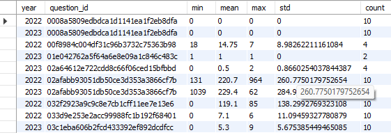

- aggregateView - Create a view aggregated at the specified level. This procedure is useful for analyses on a particular question.

```
CALL pir_data.aggregateView('test', 'state', '4204a9701b894bb9ecd39865c6b30cc8', 'uqid');
SELECT * FROM test_state;
```

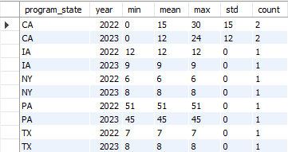

- genDifference - Generate a new column based on a linear combination of two others. Users can use this procedure to derive new constructs, or to recreate variables that have been combined or disaggregated over time.

```
CALL pir_data.genDifference(
  '-', 
  'f62df076f06ee94c718e42ef615b8bbd', 
  'TotalCumulativeEnrollment', 
  'aebc6cd42d9cc51b78745fb59791c5dd', 
  'PregnantWomen', 
  'ChildEnrollment'
);
```

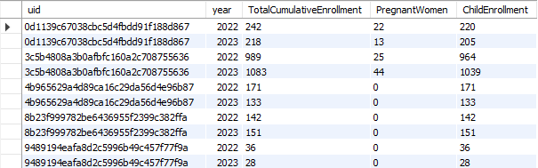

- getProgramLevelData - Get program-level data from the response table. This is a shortcut for querying both the response and program tables by question_id.

```
CALL pir_data.getProgramLevelData('question_id', '4204a9701b894bb9ecd39865c6b30cc8');
```

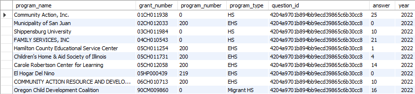

- getQuestion - Get program-level data from the response table by question ID. This procedure queries across the pir_data and pir_question_links schemas enabling users to get data for a question across years, even when the question ID associated with that question changes over time.

```
CALL pir_data.getQuestion('4204a9701b894bb9ecd39865c6b30cc8', 'uqid');
```

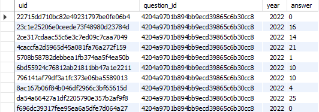

- keywordSearch - Search table, on column, by string. This uses REGEX behind the scenes so some wildcards can be used. This procedure is useful for finding records when only one piece of information about the records is known. It also underlies the keyword search functionality in the dashboard.

```
CALL pir_data.keywordSearch("question", "question_name", "cumulative", 0);
```

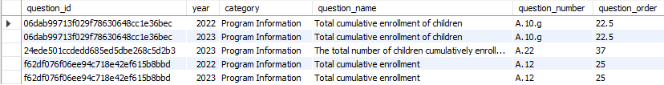

#### Procedures: PIR Question Links

- keywordSearch - Search table, on column, by string. This uses REGEX behind the scenes so some wildcards can be used. This procedure is useful for finding records when only one piece of information about the records is known. It also underlies the keyword search functionality in the dashboard.

```
CALL pir_question_links.keywordSearch("linked", "question_name", "cumulative", 0);
```

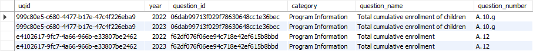

- reviewUnlinked - View a question and its proposed links. Used in the Monitoring Dashboard for reviewing unlinked questions.

```
CALL pir_question_links.reviewUnlinked("184047b683ff56a3dc38c71d15f785cb");
```

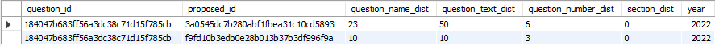

- reviewManual - View information about manually linked and unlinked questions. Used in the Monitoring Dashboard for reviewing manually links.

```
CALL pir_question_links.reviewManual('linked');
```

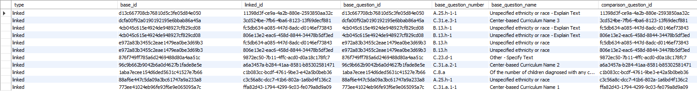

### [Creating Views](https://dev.mysql.com/doc/refman/8.0/en/create-view.html)

The utility of views is in their ability to store a common query. This is different from a stored procedure in that a view receives similar treatment to a table: it can be queried, used in joins, etc. The syntax for a basic view might look like this:

```
CREATE OR REPLACE VIEW <schema_name>.<view_name> AS
<SELECT query>
;
```

## Continuing Development

### Introduction

As you work with the pipeline, you may notice bugs or features you feel are missing. This last section of the training outlines, at a high level, how you can make changes to the package locally and how you can contribute to the public version of the package.

### Updating the Package Locally

If you followed the installation instructions, you will have cloned the [ACF-pir-data GitHub repository](https://github.com/HHS/ACF-pir-data/tree/main) and have a sub-directory in that directory called `venv` serving as your Python virtual environment. This is where all of the code for the PIR pipeline is stored, as well as the configuration file. You can modify the code by navigating to `venv\Lib\site-packages\pir_pipeline`. Changes made to the code here should immediately be reflected in the behavior of the package (with the exception of stored procedures, which must be updated in the PIR Database).

### Setting up a Development Environment

There are limitations to what can be changed working with the standard installation. One cannot, for example, introduce new command-line scripts if they have installed the package in the way described in this training. If what is desired is a development environment, the following steps should be taken:

- **Optional**: Fork the PIR repository. If you foresee yourself contributing new features to the package, then you will need to fork the repository in order to make pull requests:

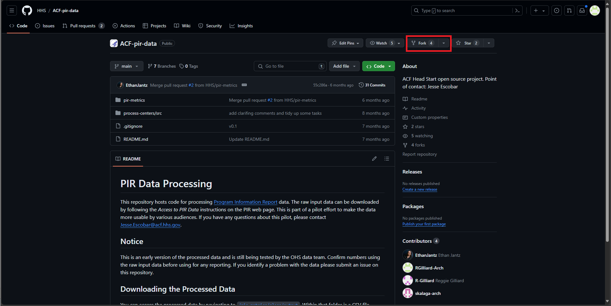

- Navigate to the repository (either your fork or the original directory to which you cloned ACF-pir-data)
- Create a new virtual environment (henceforth, `.venv`): `python -m venv .venv`
- Activate the virtual environment: `.venv\Scripts\activate`
- Install the PIR Pipeline in editable mode:
    ```
    cd PIR_pipeline
    pip install -e .
    ```
    Note that you will need a separate configuration file for this installation. Rather than walking through the the full installation again, you can just copy the config.json file that you've already created in `venv`:
    ```
    copy venv\Lib\site-packages\pir_pipeline\config.json .venv\Lib\site-packages\pir_pipeline\
    ```
You now have a fully customizable PIR Pipeline installation. Some changes, specifically those involving adding or removing command-line scripts from the package, will not be reflected until the package is installed again. Running `pip install -e .` will make those changes available.

### Rebuilding the package

Within the newly created virtual environment, upgrade [pip](https://packaging.python.org/en/latest/key_projects/#pip) with `py -m pip install --upgrade pip` and upgrade [build](https://packaging.python.org/en/latest/key_projects/#build) with `py -m pip install --upgrade build`.

To rebuild the distribution packages with your latest changes:

```
cd PIR_pipeline
py -m build
```

This command needs to be run from the same directory at which pyproject.toml is located. Note that if the package is rebuilt without changing the version, users will have to [force reinstall](https://pip.pypa.io/en/latest/ux-research-design/research-results/pip-force-reinstall/) the package to apply the changes. To avoid this, when adding new features update the version in pyproject.toml.

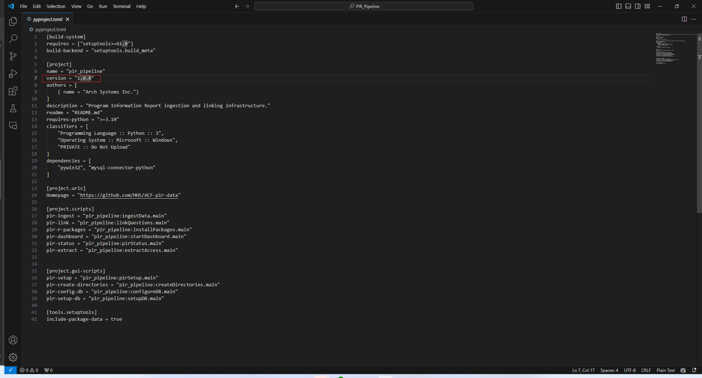

Reinstalling or updating the package will only change files that pip itself creates. This means that users will not need to recreate the config.json, pir_pipeline.Rproj, or reinstall R packages after each package update.

### Helpful Links

- [Python Packaging User Guide](https://packaging.python.org/en/latest/overview/)
- pyproject.toml guidance
    - [pip Documentation](https://pip.pypa.io/en/stable/reference/build-system/pyproject-toml/)
    - [Python Packaging User Guide: pyproject.toml](https://packaging.python.org/en/latest/guides/writing-pyproject-toml/)