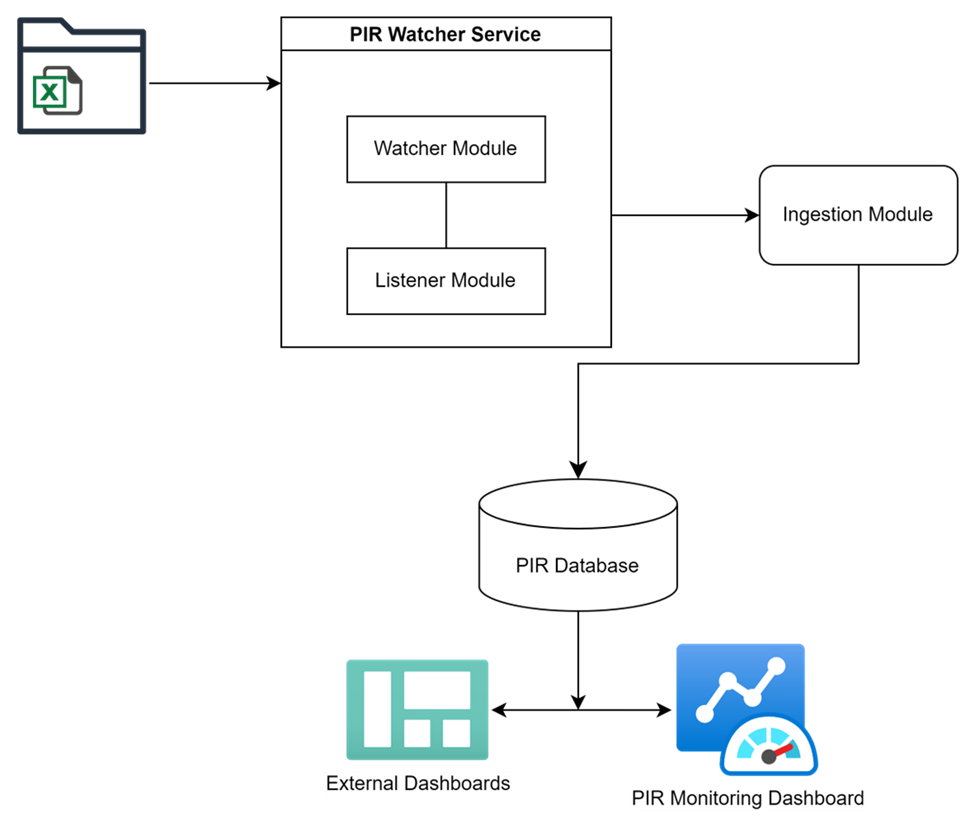

# PIR Pipeline Technical Documentation

Table of Contents
---------

- [Project Overview](#project-overview)
- [Pipeline Dependencies](#pipeline-dependencies)
    - [Software](#software)
        - [Required](#required)
        - [Optional](#optional)
    - [Python Packages](#python-packages)
    - [R Packages](#r-packages)
- [Pipeline Setup](#pipeline-setup)
    - [Relevant Commands](#relevant-commands)
    - [Relevant Scripts](#relevant-scripts)
    - [Details](#details)
- [Pipeline Diagram](#pipeline-diagram)
- [Pipeline Workflow](#pipeline-workflow)
    - [PIR Service](#pir-service)
        - [Watcher](#watcher)
            - [Relevant Scripts](#relevant-scripts-1)
            - [Details](#details-1)
        - [Listener](#listener)
            - [Relevant Scripts](#relevant-scripts-2)
            - [Details](#details-2)
    - [Ingestion](#ingestion)
        - [Relevant Commands](#relevant-commands-1)
        - [Extraction](#extraction)
            - [Relevant Scripts](#relevant-scripts-3)
            - [Details](#details-3)
        - [Transformation](#transformation)
            - [Relevant Scripts](#relevant-scripts-4)
            - [Details](#details-4)
        - [Loading](#loading)
            - [Relevant Scripts](#relevant-scripts-5)
            - [Details](#details-5)
        - [Wrap-up](#wrap-up)
            - [Relevant Scripts](#relevant-scripts-6)
            - [Details](#details-6)
- [Question Linkage](#question-linkage)
    - [Relevant Commands](#relevant-commands-2)
    - [Relevant Scripts](#relevant-scripts-7)
    - [Relevant Data](#relevant-data)
    - [Details](#details-7)
- [PIR Database](#pir-database)
    - [pir\_data](#pir_data)
        - [Tables](#_Toc183747121)
        - [Functions](#functions)
        - [Stored Procedures](#stored-procedures)
    - [pir\_logs](#pir_logs)
        - [Tables](#tables)
    - [pir\_question\_links](#pir_question_links)
        - [Tables](#tables-1)
        - [Functions](#functions-1)
        - [Stored Procedures](#stored-procedures-1)
        - [Views](#views)
- [PIR Monitoring Dashboard](#pir-monitoring-dashboard)
    - [Relevant Scripts](#relevant-scripts-8)
        - [Server](#server)
        - [UI](#ui)
        - [Dashboard](#dashboard)
    - [Details](#details-8)
        - [Question Link Overview](#question-link-overview)
        - [Search for Questions By Keyword](#search-for-questions-by-keyword)
        - [Review Links](#review-links)

Project Overview
================

Each year the Office of Head Start collects data on the services, staff,
children, and families served by Head Start and Early Head Start
Programs nationwide in its Program Information Report (PIR).[^1] PIR
data is incredibly rich, and its availability over time makes it a
source ripe for data analysis. The PIR Pipeline provides a standardized
approach to the extraction, transformation, and storage of PIR data. The
pipeline also includes logic for establishing longitudinal links between
questions.

Pipeline Dependencies
=====================

Software
--------

### Required

The software listed here is required. Each bullet point lists the piece
of software to the left of the colon, and the version that was used in
development to the right.

-   R: 4.3.2

    -   RTools: 4.3

-   Python: 3.10 or greater

-   MySQL: 8.0.35

### Optional

The software listed here will be helpful to have if the user wishes to
make changes to any elements of the pipeline.

-   RStudio: 2023.09.1+494 \"Desert Sunflower\"

-   VSCode: 1.85.1

-   MySQL Workbench: 8.0.34

Python Packages
---------------

Python package management is handled by pip. A list of the packages
installed can be found in the project's 
[pyproject.toml file](https://github.com/HHS/ACF-pir-data/blob/packaging/PIR_Pipeline/pyproject.toml),
in the list of dependencies.

R Packages
----------

R package management is handled by renv. A list of the packages
installed can be found in the [renv.lock file](https://github.com/HHS/ACF-pir-data/blob/packaging/PIR_Pipeline/src/pir_pipeline/renv.lock).

Pipeline Setup
==============

A user installs the PIR Pipeline by first acquiring the
pir\_pipeline-1.0.0-py3-none-any.whl file (either by cloning the full
ACF-pir-data repository or by downloading the file directly). The user
can then create a virtual environment and install the package in the
virtual environment using pip. A command is available on the command
line, pir-setup, which allows users to set up the PIR directory
structure, provide the path to their RScript.exe, and set up the PIR
database. The scripts involved in these steps are described in further
detail below. File paths in this section assume a starting directory,
denoted by \~, of PIR\_pipeline/src/pir\_pipeline.

Relevant Commands
-----------------

-   pir-setup

-   pir-create-directories

-   pir-config-db

-   pir-r-packages

Relevant Scripts
----------------

-   \~/\_common/installation/installPackages.R

-   \~/configureDB.py

-   \~/createDirectories.py

-   \~/createRProj.py

-   \~/installPackages.py

-   \~/pirSetup.py

-   \~/setupDB.py

Details
-------

After package installation, setup is initiated by typing pir-setup into
the command line. This command runs pirSetup.main() which in turn calls
a series of scripts.

First createDirectories.main() is called. This opens a GUI that allows
users to specify the PIR root directory and the path to the Rscript
executable. If Rscript.exe is under "C:\\Program Files\\R\\\*\\bin\\" it
will suggest this path by default. The default suggestion for the PIR
root is "C:\\Program Files\\PIR". Clicking the \"Finish\" button creates
a series of predefined directories within the specified PIR root
directory and saves these settings along with the Rscript path to a
"config.json" file.

Next, configureDB.main() is called which opens a second GUI for users to
enter and save database connection details. Clicking finish collects
these inputs and updates the "config.json" file accordingly. The script
then attempts to initiate a database setup process by calling
setupDB.main(). This script automates the process of setting up the PIR
database. It retrieves all SQL files from the "\~/pir\_sql" and executes
schema files followed by data files sequentially. Each SQL file's
content is executed as a separate SQL command. The script handles
potential errors during execution and retries failed commands up to 10
times before exiting.

Finally, pir-setup attempts to install R packages and configure renv. A
call is made to createRProj.main() which writes the .Rproj text file
needed to use renv. Then installPackages.main() is run which simply
calls \~/\_common/installation/installPackages.R. This R script sources
the activate.R script included in the package (and built by renv
itself), and then runs renv::restore() to install packages, and
renv::activate() to create the .Rprofile file.

Pipeline Diagram
================

Pipeline Workflow
=================

The PIR Pipeline uses R, Python, and SQL (MySQL) to extract PIR data
from Excel workbooks in xlsx or xls format, transform the data, load the
results in a MySQL database, and link questions across years. The
pipeline was developed on and is designed for Windows OS. Many elements
of the ingestion module can be parallelized using the furrr package,
however users are likely to run into memory issues when processing
multiple files at once. For this reason, the extraction, transformation,
and loading are done sequentially, one file at a time. An overview of
each of the core pipeline modules is provided below.

PIR Service
-----------

The PIR pipeline ships with the facilities necessary to establish a
Windows service for automatically monitoring the path where raw PIR data
is placed. Service start initializes and starts the folder watcher
functionality, which continuously monitors for new files in the
specified directory. The service sleeps for 60 seconds between each
monitoring cycle. One limitation is that this service can only be
installed by those with administrative permissions. Users with the
requisite permissions can install the service by typing "python
\<path-to-watcher\_service.py\> install". File paths in this section
assuming a starting directory of
PIR\_pipeline/src/pir\_pipeline/pir\_watcher.

### Watcher

#### Relevant Scripts

-   \~/watcher.py

-   \~/watcher\_service.py

#### Details

Users can install the PIR service by running watcher\_service.py. This
will create a Windows service, \"PIRWatcher\", that is responsible for
monitoring the PIR\_data\_repository/Raw directory for .xlsx and .xls
files. Every minute the service will call watcher.py (or watcher.py will
be called pir-ingest is invoked from the command line). This program
looks in the raw folder to see if any files are present. If there files,
it describes those files&mdash;extracting such information as names, size,
and modification time&mdash;and passes that information to listener.py.

### Listener

#### Relevant Scripts

-   \~/ listener.py

#### Details

listener.py operates by taking the information from watcher.py and
handling files based on their file extension. Excel files (.xlsx, .xls)
are queued for ingestion, while other file types are moved to a separate
\"Unprocessed\" directory. For the selected files, the script generates
a unique ingestion task by creating a batch file (\*.bat) containing R
script execution commands along with the paths of the selected files.
This batch file is scheduled for execution using the Windows Task
Scheduler.

Ingestion is always scheduled to run at 1:00 am the next day (when we
assume the computer will not be in use). Relevant information about the
ingestion task&mdash;including timestamps, scheduled execution details, and
any errors encountered during task scheduling or execution&mdash;are logged
into pir\_logs.pir\_listener\_logs. The batch files used in task
execution include code to 1) delete the task that executed them and 2)
delete themselves.

Ingestion
---------

The extant PIR processing code is written in R. To ease the transition
from this codebase to the PIR pipeline we have developed, the ingestion
module is written primarily in R. The ingestion module will receive a
list of files, either from listener.py or directly from the user, and
perform the ETL process that results in the data being inserted in the
MySQL database. Data must be in an xlsx or xls formatted Excel workbook.
The workbook must include the year that the data apply to in the file
name, just before the file extension: i.e. pir\_export\_2009.xlsx.
Additional details on each of the extraction, transformation, and
loading steps of the ingestion module are outlined below. File paths in
this section assume a starting directory, of
PIR\_pipeline/src/pir\_pipeline/pir\_ingestion.

### Relevant Commands

-   pir-ingest

    -   \--now - Ingest the data in the Raw folder immediately.

    -   \--files - When used with \--now, ingest the files listed.

### Extraction

#### Relevant Scripts

-   \~/utils/extractPirSheets.R

-   \~/utils/loadPirData.R

-   \~/utils/loadPirSection.R

#### Details

The extraction process expects to find the following sheets in the
workbook:

1.  Sheets containing the word "Section"

    a.  These sheets should contain the responses provided by programs
        to a given section of the PIR survey. The sheet should begin
        with the word \"Section", followed by a space and a single
        letter (e.g. "Section A"). Anything can follow the single
        letter. The first row should contain the question name. The
        second row should contain the question number or column name.
        All other rows should contain program-level data.

2.  One sheet called "Reference"

    b.  This sheet should contain meta-data about the questions in each
        section. Crucial fields are category, section, subsection,
        question order, question number, question name, type, and
        question text.

3.  One sheet containing the word "Program" (i.e. "Program Details")

    c.  This sheet should contain meta-data about the respondents
        (programs) to the PIR survey. The data should be unique by grant
        number, program number, and program type.

Files are first passed to extractPirSheets.R, which stores the relevant
sheet names as attributes of each element in the list of files passed by
listener.py (or the user if using pir-ingest \--now --files
\<paths-to-files\>). Next, loadPirData.R loads the data from these
sheets, lightly manipulating the names of the sheets so they are simpler
to work with in R. If the sheet contains the word "Section,"
loadPirData.R passes the work to loadPirSection.R, which extracts the
question names from the first row of the data and stores this
information as an attribute as well, before removing the first row
entirely.

### Transformation

#### Relevant Scripts

-   \~/utils/loadPirSection.R

-   \~/utils/appendPirSections.R

-   \~/utils/mergePirReference.R

-   \~/utils/cleanPirData.R

#### Details

In addition to removing the question name row, loadPirSection.R reshapes
data long. From a data set uniquely identified by grant number, program
number, and program type derives a data set that is unique by grant
number, program number, program type, question number, and question
name. The data is then passed into appendPirSections.R, which appends
the reshaped data from the "Section" sheets to create a single table
called *response*.

Next, the *question* and *unmatched\_question* tables are created. Both
the *response* table and the data extracted from the "Reference" sheet
are loaded. A series of checks is then performed: 1) if any question has
a missing question\_number, then this question is added to the
*unmatched\_question* table; 2) if any question appears only in the
*response* table, but is not present in the "Reference" sheet, then this
question is added to the *unmatched\_question* table; 3) if a question
does not merge exactly on question\_number and question\_name, and has
not already been identified as unmatched, this question is added to the
*unmatched\_question* table. It is important to note that questions in
the *unmatched\_question* table are also present in the *question*
table. The *unmatched\_question* table eases the process of finding and
understanding questions that do not align perfectly between the
*response* and *question* tables. The *question* table still retains as
much information as possible about all questions.

Final transformations happen within cleanPirData.R. The following
cleaning steps are performed universally across the three tables in the
pir\_data schema&mdash;*response, question,* and *program:*

1.  Variable names are converted to lower snake case.

2.  Year is added to the table.

3.  Primary keys are created by hashing a combination of variables that
    uniquely identify a row:

    a.  uid - Created by hashing grant\_number, program\_number, and
        program\_type

    b.  question\_id - Created by hashing question\_number, and
        question\_name

4.  Any variables in the schema that are missing from the table are
    added.

5.  Only those variables that appear in the table schemas are kept.

A small number of table-specific cleaning steps are applied such as
renaming variables and converting variables to numeric.

### Loading

#### Relevant Scripts

-   \~/utils/insertPirData.R

-   \~/../\_common/R/replaceInto.R

#### Details

The data are passed to insertPirData.R for insertion into the target
database. insertPirData.R is a simple wrapper for replaceInto.R that
loops over the workbooks and schemas being inserted.

### Wrap-up

#### Relevant Scripts

-   \~/../\_common/R/moveFiles.R

-   \~/../\_common/R/writeLog.R

#### Details

After ingestion, the successfully ingested workbooks are moved, by
moveFiles.R, from the Raw data folder to the Processed data folder.
During the ingestion a data frame logging the success and failure
messages encountered is created. This data frame is written directly
into pir\_logs.pir\_ingestion\_logs. The database connection is then
closed and the garbage collector called.

Question Linkage
----------------

To help users leverage the PIR data longitudinally, the pipeline ships
with logic for linking questions across years. Using this piece of the
pipeline requires that some data has already been ingested. With at
least two years of data ingested, links can begin to be made (although
the scripts can be run successfully with a single year of data
ingested). File paths in this section assume a starting directory of
PIR\_pipeline/src/pir\_pipeline/pir\_question\_links.

### Relevant Commands

-   pir-link

### Relevant Scripts

-   \~/linkQuestions.R

-   \~/utils/getSchemas.R

-   \~/utils/getTables.R

-   \~/utils/checkLinked.R

-   \~/utils/genUQID.R

-   \~/utils/determineLink.R

-   \~/utils/separateCombined.R

-   \~/utils/checkUnlinked.R

-   \~/utils/cleanQuestions.R

-   \~/../\_common/R/replaceInto.R

-   \~/utils/updateUnlinked.R

-   \~/utils/adHocLinks.R

### Relevant Data

-   \~/utils/ad\_hoc\_links.RDS

### Details

Linking begins by querying MySQL, using getSchemas.R, to get table
schemas from the pir\_data and pir\_question\_links schemas as well as
querying pir\_data.question for the unique years of question data that
are available. The script then loops through each year, and attempts to
link the questions in the present year with any questions in the
pir\_question\_links.linked and pir\_question\_links.unlinked tables.

When linkQuestions.R is run (either directly or by calling pir-link),
the questions to match (QTM) in each year are first checked against the
extant set of questions by checkLinked.R and checkUnlinked.R.
checkLinked.R first checks for direct matches on question\_id in both
pir\_question\_links.linked and pir\_question\_links.unlinked. Questions
with identical question\_id are assumed to be the same across years.
Questions matched directly on question\_id are removed from QTM and
recorded in a data frame to be inserted into
pir\_question\_links.linked.

An attempt is then made to match the remaining questions in QTM to those
in pir\_question\_links.linked using a string distance algorithm. The
string distance between the question\_name, question\_number, section,
and question\_text of each question in QTM and each question in
pir\_question\_links.linked is calculated using a variation of the
Levenshtein distance. Matches must come from the same section: a
question in Section A cannot be linked to a question in Section B. Two
questions are considered linked when two of the remaining three string
distances are equal to 0. That is, if question\_name\_dist and
question\_text\_dist are both 0 then the two questions are linked and so
on for the other possible two-choice combinations of question\_name,
question\_number, and question\_text. Any questions linked in this way
are also removed from QTM and added to the data frame being prepared for
insertion into pir\_question\_links.linked.

The same algorithm is used in checkUnlinked.R to attempt linkages
between QTM and questions in pir\_question\_links.unlinked.

After checking pir\_question\_links.linked and
pir\_question\_links.unlinked, a call is made to cleanPirQuestions.R to
perform some data integrity checks and prepare the data for insertion
into MySQL. Questions are then inserted into the relevant tables using
replaceInto.R. After insertion, updateUnlinked.R confirms that questions
in pir\_question\_links.linked do not appear in
pir\_question\_links.unlinked. If any questions are in both tables, they
are removed from pir\_question\_links.unlinked.

A series of ad-hoc linking steps are performed after iterating through
every year available. Those steps can be reviewed (and modified) in
adHocLinks.R. This set of ad-hoc links, like those made or destroyed in
the dashboard, are recorded in pir\_logs.pir\_manual\_question\_link.

PIR Database
------------

The PIR database is composed of three schemas each consisting of several
tables, views, functions, and stored procedures. Those schemas are
detailed below.

### pir\_data

This schema contains all data from the PIR exports.

#### Tables

-   response - Contains information present in \"Section\" sheets of PIR
    exports. Each program\'s (identified by uid) responses to the
    questions in the section are stored in the answer column. Questions
    are identified by question\_id and the year column identifies the
    year a given response comes from. This table contains foreign key
    references to both pir\_data.question and pir\_data.program. These
    references are temporarily disabled during the ingestion process to
    allow for data to be inserted into pir\_data.response before the
    corresponding records enter either pir\_data.program or
    pir\_data.question data.

-   question - Contains all unique questions and meta-data about them
    such as the question name, question number, question text, etc.

-   program - Contains all unique programs and meta-data about them such
    as the region and state in which they are located, grant number,
    program type, etc.

#### Functions

-   aggregateWhereCondition - Concatenate\'s a series of column names
    with AND to create a syntactically correct where condition.

#### Stored Procedures

-   aggregateTable - Create a table aggregated at the specified level.

-   aggregateView - Create a view aggregated at the specified level.

-   genDifference - Generate a new column based on a linear combination
    of two others.

-   getProgramLevelData - Get program-level data from the response
    table.

-   getQuestion - Get program-level data from the response table by
    question ID.

-   keywordSearch - Search table, on column, by string. This uses REGEX
    behind the scenes so some wildcards can be used.

### pir\_logs

This schema contains all logs for the PIR pipeline.

#### Tables

-   pir\_ingestion\_logs - Contains ingestion logs.

-   pir\_question\_linkage\_logs - Contains question linkage logs.

-   pir\_listener\_logs - Contains logs for the listener/scheduled
    ingestions.

-   pir\_manual\_question\_link - Contains logs of manual question
    links. Executing pir-link may populate this schema due to ad-hoc
    links embedded in the linking process. In addition, any time a user
    creates or deletes a link in the PIR Monitoring Dashboard, an entry
    will be made in this log.

### pir\_question\_links

This schema contains information regarding questions that have been
linked across time. This schema introduces an identifier not present in
the tables in the pir\_data schema, uqid (unique question ID), which
identifies a group of questions linked over time.

#### Tables

-   linked - Contains questions that have been linked across at least
    two years.

-   new\_questions - Contains questions that appear for the first time
    in any given year.

-   proposed-link - Intermediary table for creation of unlinked view.

-   unlinked - Contains questions that could not be linked across at
    least two years.

#### Functions

-   addQuestionID - Add a field to a JSON array. Used to add question ID
    to the proposed\_link JSON arrays.

-   combineArray - Combine two JSON array columns and return the
    combined column.

-   maxYearLinked - Return the maximum year in the linked table.

-   minYearLinked - Return the minimum year in the linked table.

#### Stored Procedures

-   keywordSearch - Search table, on column, by string. This uses REGEX
    behind the scenes so some wildcards can be used.

-   newQuestions - Create or update the new\_questions table.

-   reviewUnlinked - Return a question and its proposed links. Used in
    the Monitoring Dashboard for reviewing unlinked questions.

#### Views

-   inconsistent\_question\_id\_v - A view displaying all questions that
    are linked, but question\_id varies within uqid.

-   imperfect\_link\_v - A view combining the
    inconsistent\_question\_id\_v and intermittent\_link\_v views.

-   intermittent\_link\_v - A view displaying all questions that are
    linked, but do not cover the full period of years available.

-   unlinked\_v - A view of the unlinked table where proposed\_link has
    been unpacked.

PIR Monitoring Dashboard
------------------------

The PIR Monitoring Dashboard offers a centralized platform for users to
conveniently access question status and relevant review links. It
consists of three main tabs:

-   **Question Link Overview**: Provides a comprehensive summary of the
    latest status updates.

-   **Search for Questions By Keyword**: Enables users to search for
    specific questions using keywords.

-   **Review Links**: Facilitates the review process by presenting
    relevant links.

File paths referenced in this section assume a starting directory of
**PIR\_pipeline/src/pir\_pipeline/pir\_question\_links/dashboard**.

### Relevant Scripts

#### Server

-   \~/server\_scripts/homeServer.R

-   \~/server\_scripts/inconsistentIDServer.R

-   \~/server\_scripts/intermittentLinkServer.R

-   \~/server\_scripts/keywordSearchServer.R

-   \~/server\_scripts/reviewUnlinkedServer.R

-   \~/server\_scripts/viewServer.R

#### UI

-   \~/ui\_scripts/homeUI.R

-   \~/ui\_scripts/inconsistentIDUI.R

-   \~/ui\_scripts/intermittentLinkUI.R

-   \~/ui\_scripts/keywordSearchUI.R

-   \~/ui\_scripts/questionReviewUI.R

-   \~/ui\_scripts/reviewUnlinkedUI.R

-   \~/ui\_scripts/viewUI.R

#### Dashboard

-   \~/qldSetup.R

-   \~/questionLinkDashboard.R

### Details

#### Question Link Overview

This section contains three tabs: Ingestion Logs, Question Linkage Logs,
and Listener Logs. Each tab features a table with four columns:

-   **Run**: Indicates the date/time when the process was executed.

-   **Date**: Displays the date/time of completion.

-   **Message**: Shows the latest log entry.

-   **Status**: Indicates whether the process was successful or
    encountered a failure.

#### Search for Questions By Keyword

This section offers three search criteria to facilitate navigation:

-   **Table**: Provides a selection of eight tables representing various
    stages of the question link process, including Imperfect\_link\_v,
    inconsistent\_question\_id\_v, intermittent\_link\_v, linked,
    new\_questions, proposed\_link, unlinked, and unlinked\_v.

-   **Search Column**: Offers consistent columns for search queries,
    including question\_name, question\_text, question\_number,
    category, and section.

-   **Keyword(s) Search**: Enables users to search for one or more
    keywords across the selected table and column for efficient
    retrieval of relevant information.

#### Review Links

While the algorithm effectively links questions, certain scenarios may
necessitate manual review. These include:

-   **Partial Period Linkage**: Questions linked within a subset of the
    available period.

-   **Variable Question IDs**: Linked questions with varying IDs over
    time.

-   **Unlinked Questions**: Questions that remain unlinked.

The dashboard offers options for manual link creation and deletion to
address these conditions:

-   Review Unlinked Questions
    -   Under the \"Review Unlinked Questions\" tab, users can review
        and link unlinked questions. This involves selecting the
        unlinked question ID, choosing the algorithm for linkage (Base
        or Jaccard), reviewing proposed links, and confirming the chosen
        link.

<!-- -->

-   Review Intermittent Links
    -   This section aims to establish links covering the full year
        range. Base questions without full-year matches are paired with
        proposed links, ensuring consistency in \'uqid\' and \'question
        id\'.

-   Review Inconsistent Links
    -   The \"Review Inconsistent Links\" tab enables the management of
        inconsistent question links. Users can identify, review, and
        unlink specific questions, ensuring data integrity.

[^1]: [Program Information Report (PIR) \| ECLKC
    (hhs.gov)](https://eclkc.ohs.acf.hhs.gov/data-ongoing-monitoring/article/program-information-report-pir)
