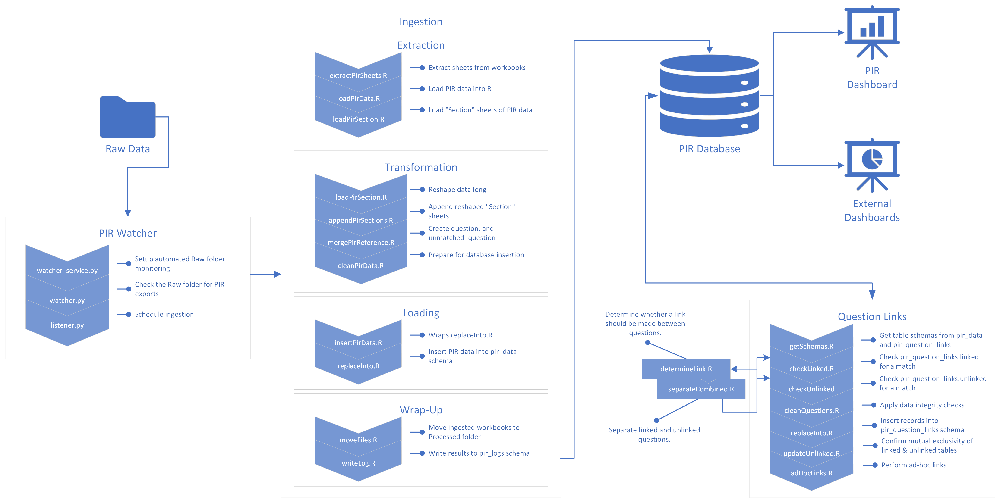

# PIR Pipeline Technical Documentation

## Table of Contents

- [Project Overview](#project-overview)
- [Pipeline Dependencies](#pipeline-dependencies)
    - [Software](#software)
        - [Required](#required)
        - [Optional](#optional)
    - [Python Packages](#python-packages)
    - [R Packages](#r-packages)
- [Pipeline Setup](#pipeline-setup)
    - [Relevant Commands](#relevant-commands)
    - [Relevant Scripts](#relevant-scripts)
    - [Details](#details)
- [Pipeline Diagram](#pipeline-diagram)
- [Pipeline Workflow](#pipeline-workflow)
    - [PIR Service](#pir-service)
        - [Watcher](#watcher)
            - [Relevant Scripts](#relevant-scripts-1)
            - [Details](#details-1)
        - [Listener](#listener)
            - [Relevant Scripts](#relevant-scripts-2)
            - [Details](#details-2)
    - [Ingestion](#ingestion)
        - [Relevant Commands](#relevant-commands-1)
        - [Extraction](#extraction)
            - [Relevant Scripts](#relevant-scripts-3)
            - [Details](#details-3)
        - [Transformation](#transformation)
            - [Relevant Scripts](#relevant-scripts-4)
            - [Details](#details-4)
        - [Loading](#loading)
            - [Relevant Scripts](#relevant-scripts-5)
            - [Details](#details-5)
        - [Wrap-up](#wrap-up)
            - [Relevant Scripts](#relevant-scripts-6)
            - [Details](#details-6)
- [Question Linkage](#question-linkage)
    - [Relevant Commands](#relevant-commands-2)
    - [Relevant Scripts](#relevant-scripts-7)
    - [Relevant Data](#relevant-data)
    - [Details](#details-7)
- [PIR Database](#pir-database)
    - [pir_data](#pir_data)
        - [Tables](#_Toc183747121)
        - [Functions](#functions)
        - [Stored Procedures](#stored-procedures)
    - [pir_logs](#pir_logs)
        - [Tables](#tables)
    - [pir_question_links](#pir_question_links)
        - [Tables](#tables-1)
        - [Functions](#functions-1)
        - [Stored Procedures](#stored-procedures-1)
        - [Views](#views)
- [PIR Monitoring Dashboard](#pir-monitoring-dashboard)
    - [Relevant Scripts](#relevant-scripts-8)
        - [Server](#server)
        - [UI](#ui)
        - [Dashboard](#dashboard)
    - [Details](#details-8)
        - [Question Link Overview](#question-link-overview)
        - [Search for Questions By Keyword](#search-for-questions-by-keyword)
        - [Review Links](#review-links)
- [Appendix A: A Walkthrough of the PIR Pipeline](#appendix-a-a-walkthrough-of-the-pir-pipeline)
    - [Pre Installaiton](#pre-installation)
    - [Package Installation](#package-installation)
        - [Configuration](#configuration)
        - [R Package Installation](#r-package-installation)
    - [Ingesting Data](#ingesting-data)
    - [Linking Questions](#linking-questions)
    - [Viewing the PIR Monitoring Dashboard](#viewing-the-pir-monitoring-dashboard)
        - [Question Link Overview Tab](#question-link-overview-tab)
        - [Search for Question by Keyword Tab](#search-for-question-by-keyword-tab)
        - [Review Links Tab](#review-links-tab)
            - [Review Unlinked Questions](#review-unlinked-questions)
            - [Review Intermittent Links](#review-intermittent-links)
            - [Review Inconsistent Links](#review-inconsistent-links)

## Project Overview

Each year the Office of Head Start collects data on the services, staff,
children, and families served by Head Start and Early Head Start
Programs nationwide in its Program Information Report (PIR).[^1] PIR
data is incredibly rich, and its availability over time makes it a
source ripe for data analysis. The PIR Pipeline provides a standardized
approach to the extraction, transformation, and storage of PIR data. The
pipeline also includes logic for establishing longitudinal links between
questions.

## Pipeline Dependencies

### Software

#### Required

The software listed here is required. Requirements appear in the following format:
"software: version".

-   R: 4.3.2
    -   RTools: 4.3
-   Python: 3.10 or greater
-   MySQL: 8.0.35

#### Optional

The software listed here will be helpful if the user wishes to
make changes to any elements of the pipeline.

-   RStudio: 2023.09.1+494 \"Desert Sunflower\"
-   VSCode: 1.85.1
-   MySQL Workbench: 8.0.34

### Python Packages

Python package management is handled by pip. A list of the packages
installed can be found in the project's 
[pyproject.toml file](../pyproject.toml),
in the list of dependencies.

### R Packages

R package management is handled by renv. A list of the packages
installed can be found in the [renv.lock file](../src/pir_pipeline/renv.lock).

## Pipeline Setup Overview

A user installs the PIR Pipeline by first acquiring the
pir_pipeline-1.0.0-py3-none-any.whl file (either by cloning the full
ACF-pir-data repository or by downloading the file directly). The user
can then create a virtual environment and install the package in the
virtual environment using pip. A command is available on the command
line, pir-setup, which allows users to set up the PIR directory
structure, provide the path to their RScript.exe, and set up the PIR
database. The scripts involved in these steps are described in further
detail below. File paths in this section assume a starting directory,
denoted by ~, of PIR_pipeline/src/pir_pipeline.

Step-by-step installation instructions can be found in [Appendix A](#appendix-a-a-walkthrough-of-the-pir-pipeline).

### Relevant Commands

-   pir-setup
-   pir-create-directories
-   pir-config-db
-   pir-setup-db
-   pir-r-packages

### Relevant Scripts

-   ~/_common/installation/installPackages.R
-   ~/configureDB.py
-   ~/createDirectories.py
-   ~/createRProj.py
-   ~/installPackages.py
-   ~/pirSetup.py
-   ~/setupDB.py

### Details

After package installation, setup is initiated by typing `pir-setup` into
the command line. This command runs `pirSetup.main()` which in turn calls
a series of scripts.

First `createDirectories.main()` is called. This opens a GUI that allows
users to specify the PIR root directory and the path to the Rscript
executable. The script attempts to find Rscript.exe in _C:\\Program Files\\R\\\*\\bin\\_
as well as on the user's PATH. If Rscript.exe is found in either location,
the script will suggest these paths as default options. The default suggestion for the PIR
root is _C:\\Program Files\\PIR_. Clicking the "Finish" button creates
a series of predefined directories within the specified PIR root
directory and saves these settings along with the Rscript path to a
_config.json_ file.

Next, `configureDB.main()` is called which opens a second GUI for users to
enter and save database connection details. Clicking "Finish" collects
these inputs and updates the _config.json_ file accordingly. The script
then attempts to initiate a database setup process by calling
`setupDB.main()`. This script automates the process of setting up the PIR
database. It retrieves all SQL files from the _~/pir\_sql_, executes
schema files, then executes other files. Each SQL file's
content is executed as a separate SQL command. The script handles
potential errors during execution and retries failed commands up to 10
times before exiting.

Finally, `pir-setup` attempts to install R packages and configure renv. A
call is made to `createRProj.main()` which writes the ".Rproj" text file
needed to use renv. Then `installPackages.main()` is run which
calls _~/\_common/installation/installPackages.R_. This R script sources
the activate.R script included in the package (and built by renv
itself), and then runs renv::restore() to install packages, and
renv::activate() to create the ".Rprofile" file.

## Pipeline Diagram



## Pipeline Workflow

The PIR Pipeline uses R, Python, and SQL to extract PIR data
from Excel workbooks in .xlsx or .xls format, transform the data, load the
results in a MySQL database, and link questions across years. The
pipeline was developed on and is designed for Windows OS. Many elements
of the ingestion module can be parallelized using the furrr package,
however users are likely to run into memory issues when processing
multiple files at once. For this reason, the extraction, transformation,
and loading are done sequentially, one file at a time. An overview of
each of the core pipeline modules is provided below.

## PIR Service

The PIR pipeline ships with the facilities necessary to establish a
Windows service for automatically monitoring the path where raw PIR data
is placed. Service start initializes and starts the folder watcher
functionality, which continuously monitors for new files in the
specified directory. The service sleeps for 60 seconds between each
monitoring cycle. One limitation is that this service can only be
installed by those with administrative permissions. Users with the
requisite permissions can install the service by typing "python
\<path-to-watcher_service.py\> install". File paths in this section
assume a starting directory of
_PIR\_pipeline/src/pir\_pipeline/pir\_watcher_.

### Watcher

#### Relevant Scripts

-   ~/watcher.py
-   ~/watcher\_service.py

#### Details

Users can install the PIR service by running _watcher\_service.py_. This
will create a Windows service, \"PIRWatcher\", that is responsible for
monitoring the _PIR\_data\_repository/Raw_ directory for .xlsx and .xls
files. Every minute the service will call _watcher.py_ (or _watcher.py_ will
be called `pir-ingest` is invoked from the command line). This program
looks in the raw folder to see if any files are present. If there files,
it describes those files&mdash;extracting such information as names, size,
and modification time&mdash;and passes that information to _listener.py_.

### Listener

#### Relevant Scripts

-   ~/listener.py

#### Details

_listener.py_ operates by taking the information from _watcher.py_ and
handling files based on their file extension. Excel files (.xlsx, .xls)
are queued for ingestion, while other file types are moved to a separate
\"Unprocessed\" directory. For the selected files, the script generates
a unique ingestion task by creating a batch file (\*.bat) containing R
script execution commands along with the paths of the selected files.
This batch file is scheduled for execution using the Windows Task
Scheduler.

Ingestion is always scheduled to run at 1:00 am the next day (when we
assume the computer will not be in use). Relevant information about the
ingestion task&mdash;including timestamps, scheduled execution details, and
any errors encountered during task scheduling or execution&mdash;are logged
into *pir_logs.pir_listener_logs*. The batch files used in task
execution include code to 1) delete the task that executed them and 2)
delete themselves.

## Ingestion

The extant PIR processing code is written in R. To ease the transition
from this codebase to the PIR pipeline we have developed, the ingestion
module is written primarily in R. The ingestion module will receive a
list of files, either from _listener.py_ or directly from the user, and
perform the ETL process that results in the data being inserted in the
MySQL database. Data must be in an .xlsx or .xls formatted Excel workbook.
The workbook must include the year that the data apply to in the file
name, just before the file extension: i.e. pir_export_2009.xlsx.
Additional details on each of the extraction, transformation, and
loading steps of the ingestion module are outlined below. File paths in
this section assume a starting directory, of
PIR_pipeline/src/pir_pipeline/pir_ingestion.

Additional details about the data ingestion process can be found in [Appendix A](#ingesting-data).

### Relevant Commands

-   pir-ingest
    -   --now - Ingest the data in the Raw folder immediately.
    -   --files - When used with --now, ingest the files listed.

### Extraction

#### Relevant Scripts

-   ~/utils/extractPirSheets.R
-   ~/utils/loadPirData.R
-   ~/utils/loadPirSection.R

#### Details

The extraction process expects to find the following sheets in the target
workbook:

1.  Sheets containing the word "Section"

    a.  These sheets should contain the responses provided by programs
        to a given section of the PIR survey. The sheet should begin
        with the word \"Section", followed by a space and a single
        letter (e.g. "Section A"). Anything can follow the single
        letter. The first row should contain the question name. The
        second row should contain the question number or column name.
        All other rows should contain program-level data.

2.  One sheet called "Reference"

    b.  This sheet should contain meta-data about the questions in each
        section. Crucial fields are category, section, subsection,
        question order, question number, question name, type, and
        question text.

3.  One sheet containing the word "Program" (i.e. "Program Details")

    c.  This sheet should contain meta-data about the respondents
        (programs) to the PIR survey. The data should be unique by grant
        number, program number, and program type.

Files are first passed to _extractPirSheets.R_, which stores the relevant
sheet names as attributes of each element in the list of files passed by
_listener.py_ (or the user if using `pir-ingest \--now --files
\<paths-to-files\>`). Next, _loadPirData.R_ loads the data from these
sheets, lightly manipulating the names of the sheets so they are simpler
to work with in R. If the sheet contains the word "Section,"
_loadPirData.R_ passes the work to _loadPirSection.R_, which extracts the
question names from the first row of the data and stores this
information as an attribute as well, before removing the first row
entirely.

### Transformation

#### Relevant Scripts

-   ~/utils/loadPirSection.R
-   ~/utils/appendPirSections.R
-   ~/utils/mergePirReference.R
-   ~/utils/cleanPirData.R

#### Details

In addition to removing the question name row, _loadPirSection.R_ reshapes
data long. From a data set uniquely identified by grant number, program
number, and program type is derived a data set that is unique by grant
number, program number, program type, question number, and question
name. The data is then passed into appendPirSections.R, which appends
the reshaped data from the "Section" sheets to create a single table
called *response*.

Next, the *question* and *unmatched_question* tables are created. Both
the *response* table and the data extracted from the "Reference" sheet
are loaded. A series of checks is performed: 1) if any question has
a missing question_number, then this question is added to the
*unmatched_question* table; 2) if any question appears only in the
*response* table, but is not present in the "Reference" sheet, then this
question is added to the *unmatched_question* table; 3) if a question
does not merge exactly on question_number and question_name, and has
not already been identified as unmatched, this question is added to the
*unmatched_question* table. It is important to note that questions in
the *unmatched_question* table are also present in the *question*
table. The *unmatched_question* table eases the process of finding and
understanding questions that do not align perfectly between the
*response* and *question* tables. The *question* table still retains as
much information as possible about all questions.

Final transformations happen within _cleanPirData.R_. The following
cleaning steps are performed universally across the three tables in the
pir_data schema&mdash;*response, question,* and *program:*

1.  Variable names are converted to lower snake case.
2.  Year is added to the table.
3.  Primary keys are created by hashing a combination of variables that
    uniquely identify a row:
    -  uid - Created by hashing grant_number, program_number, and
        program_type
    -  question_id - Created by hashing question_number, and
        question_name
4.  Any variables in the schema that are missing from the table are
    added.
5.  Only those variables that appear in the table schemas are kept.

A small number of table-specific cleaning steps are applied, such as
renaming variables and converting variables to numeric.

### Loading

#### Relevant Scripts

-   ~/utils/insertPirData.R
-   ~/../_common/R/replaceInto.R

#### Details

The data are passed to _insertPirData.R_ for insertion into the target
database. _insertPirData.R_ is a simple wrapper for _replaceInto.R_ that
loops over the workbooks and schemas being inserted.

### Wrap-up

#### Relevant Scripts

-   ~/../_common/R/moveFiles.R
-   ~/../_common/R/writeLog.R

#### Details

After ingestion, the successfully ingested workbooks are moved, by
_moveFiles.R_, from the Raw data folder to the Processed data folder.
During the ingestion a data frame logging the success and failure
messages encountered is created. This data frame is written directly
into _pir\_logs.pir\_ingestion\_logs_. The database connection is then
closed and the garbage collector called.

## Question Linkage

To help users leverage the PIR data longitudinally, the pipeline ships
with logic for linking questions across years. Using this piece of the
pipeline requires that some data has already been ingested. With at
least two years of data ingested, links can begin to be made (although
the scripts can be run successfully with a single year of data
ingested). File paths in this section assume a starting directory of
*PIR_pipeline/src/pir_pipeline/pir_question_links*.

Additional details about question linking can be found in [Appendix A](#linking-questions)

### Relevant Commands

-   pir-link

### Relevant Scripts

-   ~/linkQuestions.R
-   ~/utils/getSchemas.R
-   ~/utils/getTables.R
-   ~/utils/checkLinked.R
-   ~/utils/genUQID.R
-   ~/utils/determineLink.R
-   ~/utils/separateCombined.R
-   ~/utils/checkUnlinked.R
-   ~/utils/cleanQuestions.R
-   ~/../_common/R/replaceInto.R
-   ~/utils/updateUnlinked.R
-   ~/utils/adHocLinks.R

### Relevant Data

-   ~/utils/ad_hoc_links.RDS

### Details

Linking can be initiated by invoking `pir-link` on the command line.
This calls *linkQuestions.R*. This script begins by querying the MySQL database, 
using, making a call to *getSchemas.R* to get table
schemas from the pir_data and pir_question_links schemas as well as
querying *pir_data.question* for the unique years of question data that
are available. Next *linkQuestions.R* loops through every year and attempts to
link the questions in the present year with any questions in the
*pir_question_links.linked* and *pir_question_links.unlinked* tables.

When *linkQuestions.R* is run (either directly or by calling pir-link),
the questions to match (QTM) in each year are first checked against the
extant set of questions by *checkLinked.R* and *checkUnlinked.R*.
*checkLinked.R* first checks for direct matches on question_id in both
*pir_question_links.linked* and *pir_question_links.unlinked*. Questions
with identical question_id are assumed to be the same across years.
Questions matched directly on question_id are removed from QTM and
recorded in a data frame to be inserted into
pir_question_links.linked.

An attempt is then made to match the remaining questions in QTM to those
in *pir_question_links.linked* using a string distance algorithm. The
string distance between the question_name, question_number, section,
and question_text of each question in QTM and each question in
*pir_question_links.linked* is calculated using a variation of the
Levenshtein distance. Matches must come from the same section: a
question in Section A cannot be linked to a question in Section B. Two
questions are considered linked when two of the remaining three string
distances are equal to 0. That is, if question_name_dist and
question_text_dist are both 0 then the two questions are linked and so
on for the other possible two-choice combinations of question_name,
question_number, and question_text. Any questions linked in this way
are also removed from QTM and added to the data frame being prepared for
insertion into *pir_question_links.linked*.

The same algorithm is applied in *checkUnlinked.R* to attempt linkages
between QTM and questions in *pir_question_links.unlinked*.

After checking *pir_question_links.linked* and
*pir_question_links.unlinked*, a call is made to *cleanQuestions.R* to
perform some data integrity checks and prepare the data for insertion
into MySQL. Questions are then inserted into the relevant tables using
*replaceInto.R*. After insertion, *updateUnlinked.R* confirms that questions
in *pir_question_links.linked* do not appear in
*pir_question_links.unlinked*. If any questions are in both tables, they
are removed from *pir_question_links.unlinked*.

A series of ad-hoc linking steps are performed after iterating through
every year available. Those steps can be reviewed (and modified) in
*adHocLinks.R*. This set of ad-hoc links, like those made or destroyed in
the dashboard, are recorded in *pir_logs.pir_manual_question_link*.
Please see [adHocLinks.R](../src/pir_pipeline/pir_question_links/utils/adHocLinks.R)
for further details on the current set of ad-hoc links.

## PIR Database

The PIR database is composed of three schemas each consisting of several
tables, views, functions, and stored procedures. Those schemas are
detailed below.

### [pir_data](../src/pir_pipeline/pir_sql/pir_data/pir_data_schema.sql)

This schema contains all data from the PIR exports.

#### Tables

-   response - Contains information present in \"Section\" sheets of PIR
    exports. Each program's (identified by uid) responses to the
    questions in the section are stored in the answer column. Questions
    are identified by question_id and the year column identifies the
    year a given response comes from. This table contains foreign key
    references to both pir_data.question and pir_data.program. These
    references are temporarily disabled during the ingestion process to
    allow for data to be inserted into pir_data.response before the
    corresponding records enter either pir_data.program or
    pir_data.question.

-   question - Contains all unique questions and meta-data about them
    such as the question name, question number, question text, etc.

-   program - Contains all unique programs and meta-data about them such
    as the region and state in which they are located, grant number,
    program type, etc.

#### Functions

-   [aggregateWhereCondition](../src/pir_pipeline/pir_sql/pir_data/Functions/aggregateWhereCondition.sql) - Concatenate's a series of column names
    with AND to create a syntactically correct where condition. This function is primarily used in creating aggregating conditions
    for the `aggregateTable()` and `aggregateView()` procedures.

#### Stored Procedures

-   [aggregateTable](../src/pir_pipeline/pir_sql/pir_data/StoredProcedures/aggregateTable.sql) - Create a table aggregated at the specified level. This procedure will be useful to users planning to do a broad analysis at a particular level as it aggregates all questions in the response table to the specified level.

-   [aggregateView](../src/pir_pipeline/pir_sql/pir_data/StoredProcedures/aggregateView.sql) - Create a view aggregated at the specified level. This procedure is useful for analyses on a particular question.

-   [genDifference](../src/pir_pipeline/pir_sql/pir_data/StoredProcedures/genDifference.sql) - Generate a new column based on a linear combination
    of two others. Users can use this procedure to derive new constructs, or to recreate
    variables that have been combined or disaggregated over time.

-   [getProgramLevelData](../src/pir_pipeline/pir_sql/pir_data/StoredProcedures/getProgramLevelData.sql) - Get program-level data from the response
    table. This is a shortcut for querying both the response and program tables by question_id.

-   [getQuestion](../src/pir_pipeline/pir_sql/pir_data/StoredProcedures/getQuestion.sql) - Get program-level data from the response table by
    question ID. This procedure queries across the pir_data and pir_question_links
    schemas enabling users to get data for a question across years, even when
    the question ID associated with that question changes over time.

-   [keywordSearch](../src/pir_pipeline/pir_sql/pir_data/StoredProcedures/keywordSearch.sql) - Search table, on column, by string. This uses REGEX
    behind the scenes so some wildcards can be used. This procedure is useful 
    for finding records when only one piece of information about the records is known.
    It also underlies the keyword search functionality in the dashboard.

### [pir_logs](../src/pir_pipeline/pir_sql/pir_logs/pir_logs_schema.sql) 

This schema contains all logs for the PIR pipeline.

#### Tables

-   pir_ingestion_logs - Contains ingestion logs.
-   pir_question_linkage_logs - Contains question linkage logs.
-   pir_listener_logs - Contains logs for the listener/scheduled
    ingestions.
-   pir_manual_question_link - Contains logs of manual question
    links. Executing pir-link may populate this schema due to ad-hoc
    links embedded in the linking process. In addition, any time a user
    creates or deletes a link in the PIR Monitoring Dashboard, an entry
    will be made in this log.

### [pir_question_links](../src/pir_pipeline/pir_sql/pir_question_links/pir_question_links_schema.sql) 

This schema contains information regarding questions that have been
linked across time. This schema introduces an identifier not present in
the tables in the pir_data schema, uqid (unique question ID), which
identifies a group of questions linked over time.

#### Tables

-   linked - Contains questions that have been linked across at least
    two years.
-   proposed-link - Intermediary table for creation of unlinked view.
-   unlinked - Contains questions that could not be linked across at
    least two years.

#### Functions

-   [addQuestionID](../src/pir_pipeline/pir_sql/pir_question_links/Functions/addQuestionID.sql) - Add a field to a JSON array. Used to add question ID
    to the proposed_link JSON arrays.
-   [combineArray](../src/pir_pipeline/pir_sql/pir_question_links/Functions/combineArray.sql) - Combine two JSON array columns and return the
    combined column. Used in the `proposedLink()` procedure.
-   [maxYearLinked](../src/pir_pipeline/pir_sql/pir_question_links/Functions/maxYearLinked.sql) - Return the maximum year in the linked table. Used when building *intermittent_link_v*.
-   [minYearLinked](../src/pir_pipeline/pir_sql/pir_question_links/Functions/minYearLinked.sql) - Return the minimum year in the linked table. Used when building *intermittent_link_v*.

#### Stored Procedures

-   [keywordSearch](../src/pir_pipeline/pir_sql/pir_question_links/StoredProcedures/keywordSearch.sql) - Search table, on column, by string. This uses REGEX
    behind the scenes so some wildcards can be used. This procedure is useful 
    for finding records when only one piece of information about the records is known.
    It also underlies the keyword search functionality in the dashboard.
-   [proposedLink](../src/pir_pipeline/pir_sql/pir_question_links/StoredProcedures/proposedLink.sql) - Create or update the proposed_link table. This procedure is
    only used in dashboard reporting.
-   [reviewUnlinked](../src/pir_pipeline/pir_sql/pir_question_links/StoredProcedures/reviewUnlinked.sql) - Return a question and its proposed links. Used in
    the Monitoring Dashboard for reviewing unlinked questions.

#### Views

-   [imperfect_link_v](../src/pir_pipeline/pir_sql/pir_question_links/Views/imperfect_link.sql) - A view combining the
    *inconsistent_question_id_v* and *intermittent_link_v* views.
-   [inconsistent_question_id_v](../src/pir_pipeline/pir_sql/pir_question_links/Views/inconsistent_question_id.sql) - A view displaying all questions that
    are linked, but question_id varies within uqid.
-   [intermittent_link_v](../src/pir_pipeline/pir_sql/pir_question_links/Views/intermittent_link.sql) - A view displaying all questions that are
    linked, but do not cover the full period of years available.
-   [new_questions_v](../src/pir_pipeline/pir_sql/pir_question_links/Views/new_questions.sql) - Contains questions that appear for the first time
    in any given year.
-   [unlinked_v](../src/pir_pipeline/pir_sql/pir_question_links/Views/unlinked.sql) - A view of the unlinked table where proposed_link has
    been unpacked.

## PIR Monitoring Dashboard

The PIR Monitoring Dashboard offers a centralized platform for users to
conveniently access question status and review question links. It
consists of three primary tabs:

-   **Question Link Overview**: Provides a comprehensive summary of the
    latest status updates.
-   **Search for Questions By Keyword**: Enables users to search for
    specific questions using keywords.
-   **Review Links**: Facilitates the link review process by presenting questions 
    that may be of interest to reviewers.

File paths referenced in this section assume a starting directory of
*PIR_pipeline/src/pir_pipeline/pir_question_links/dashboard*.

### Relevant Scripts

#### Server

-   ~/server_scripts/homeServer.R
-   ~/server_scripts/inconsistentIDServer.R
-   ~/server_scripts/intermittentLinkServer.R
-   ~/server_scripts/keywordSearchServer.R
-   ~/server_scripts/reviewUnlinkedServer.R
-   ~/server_scripts/viewServer.R

#### UI

-   ~/ui_scripts/homeUI.R
-   ~/ui_scripts/inconsistentIDUI.R
-   ~/ui_scripts/intermittentLinkUI.R
-   ~/ui_scripts/keywordSearchUI.R
-   ~/ui_scripts/questionReviewUI.R
-   ~/ui_scripts/reviewUnlinkedUI.R
-   ~/ui_scripts/viewUI.R

#### Dashboard

-   ~/qldSetup.R
-   ~/questionLinkDashboard.R

### Details

#### Question Link Overview

This section contains three tables: Ingestion Logs, Question Linkage Logs,
and Listener Logs. Each table features four columns:

-   **Run**: Indicates the date/time when the process was executed.
-   **Date**: Displays the date/time of completion.
-   **Message**: Shows the latest log entry.
-   **Status**: Indicates whether the process was successful or
    encountered a failure.

#### Search for Questions By Keyword

This section offers three search criteria to facilitate navigation:

-   **Table**: Provides a selection of eight tables representing various
    stages of the question link process, including Imperfect_link_v,
    inconsistent_question_id_v, intermittent_link_v, linked,
    new_questions, proposed_link, unlinked, and unlinked_v.
-   **Search Column**: Identifies the column to search within.
-   **Keyword(s)**: Enables users to search for one or more
    keywords across the selected table and column for efficient
    retrieval of relevant information.
-   **Exact Match**: Boolean indicating whether the user wants to match exactly
or not.

#### Review Links

While the algorithm effectively links questions, certain scenarios may
necessitate manual review. These include:

-   **Partial Period Linkage**: Questions linked within a subset of the
    available period.
-   **Variable Question IDs**: Linked questions with varying IDs over
    time.
-   **Unlinked Questions**: Questions that remain unlinked.

The dashboard offers options for manual link creation and deletion to
address these conditions:

-   Review Unlinked Questions
    -   Under the "Review Unlinked Questions" tab, you can review and link unlinked questions. This process involves selecting the unlinked question ID, choosing the algorithm for linkage (either Base or Jaccard), reviewing proposed links in the table, and ultimately linking the chosen proposed link using the "Link" button. Upon accessing the tab within the dashboard interface, you'll find a list of unlinked questions awaiting review. From this list, select the question ID of the unlinked question you wish to address. Before proceeding, decide whether to utilize the base algorithm, which suggests links based on predefined criteria, or the Jaccard algorithm, which assesses similarity in question text. After selecting the algorithm, review the proposed links generated in the table. Each proposed link represents a potential connection between the unlinked question and other questions in the database. Once you've identified the most suitable link, select it within the dashboard interface. Finally, confirm your choice by clicking the "Link" button, effectively establishing the connection between the questions.
-   Review Intermittent Links
    -   This section is dedicated to establishing question links that cover the full range of years sampled. Any question that is not linked for all years will appear here as a base question with a series of proposed linkages. Below are the definitions:

        - Base: A question that is not matched for the full year range.
        - Proposed: The proposed match to the base question.

        Linking the two questions will distribute whichever 'uqid' exists in more cases across both of the question IDs.
-   Review Inconsistent Links
    -  This tab facilitates the process of unlinking previously connected questions. Identify the unique question ID of the question you wish to unlink from others, then review the associated question and its connections. Determine which specific question(s) you want to unlink from the selected question. Once you've made your selection, click on the "Unlink" button within the dashboard interface. This action will remove the specified link(s) between the selected question and the question(s) chosen to unlink.

## Appendix A: A Walkthrough of the PIR Pipeline

### Pre Installation

These installation instructions assume that the installation is happening on a system with Python (and/or Anaconda) on the PATH. If this is not true, follow the directions [for adding python to your PATH](https://realpython.com/add-python-to-path/).

It will be helpful to have a few pieces of information on hand:
1. Path to RScript.exe
    - Setup will try to find this, but in the event that it cannot the user will need to provide it.
2. Database credentials
    - Setup will specifically request the username, password, host, and port for the target server. Use credentials for an account with administrator level privileges.

### Package Installation

1.  Clone the repository from [GitHub](https://github.com/HHS/ACF-pir-data).
2.  Create a new virtual environment in which to install the package.
    -   Open up a command prompt.
    -   Navigate to where you would like to install the package.
    -   In the command prompt type `python -m venv <name-of-venv-directory>` (henceforth referred to as `venv`) and press `enter`.
        - If working with Anaconda `conda create --name <name-of-venv-directory>` should work. 

    This will create a virtual environment named `venv` in the current directory. A virtual environment is a self-contained directory tree that contains a Python installation for a particular version of Python, plus a number of additional packages. It allows you to work on the PIR Pipeline project in isolation from other projects.
3.  Activate the virtual environment.
    - In the directory where `venv` was created, type `venv\Scripts\activate` into the command prompt and press `enter`
        - With Anaconda `conda activate venv`
4.  Install the PIR Pipeline Package using the Python wheel file. The `dist` folder contains the relevant `.whl` file. Enter the following commands:
    - `cd PIR_pipeline\dist`
    - `pip install pir_pipeline-1.0.0-py3-none-any.whl`

Package installation should now be complete.

#### Configuration

1. Open the command prompt.
2. Activate the virtual environment `venv`.
3. In the command prompt type `pir-setup` and press `enter`. A GUI should appear requesting the path at which to create the PIR directories and the path to *RScript.exe*. 

4. Click `Finish` after providing these paths.
5. A second window should appear requesting database credentials.

6. Click `Finish` after entering your credentials.
7. The configuration file will now be generated, the database populated with relevant schemas, views, and stored procedures, and R packages installed.

#### R Package Installation

R packages should be installed during setup. If this did not happen, or you do not want to run the full setup, R packages can be installed by following these steps:

1. Open the command prompt.
2. Activate the virtual environment `venv`.
3. Type `pir-r-packages` and press `enter`.

### Ingesting Data

This section will refer to the directory chosen for the PIR directory structure as *PIR*. 

Raw data should be stored in *PIR\PIR_data_repository\Raw*. This is the only folder in *PIR\PIR_data_repository* that you need to manage. *PIR\PIR_data_repository\Unprocessed* will contain any files that were not processed due to incorrect file types. After a successful ingestion, files will be copied from *PIR\PIR_data_repository\Raw*, given a timestamp, and moved to *PIR\PIR_data_repository\Processed*.

The command `pir-ingest` can be used to ingest data. This command has a few options:

- `--now`: Immediately trigger ingestion.
- `--files`: Combine with `--now` to trigger immediate ingestion only for specific files.

It is important to note that when no files exist in *PIR\PIR_data_repository\Raw*, executing the command `pir-ingest` will not schedule a task in the task scheduler.

An example workflow might look like this:

1. Place data in the `PIR\PIR_data_repository\Raw` folder.
2. Open the command prompt.
3. Activate the virtual environment `venv`.
4. Type:
    - `pir-ingest` to schedule all files in the *PIR\PIR_data_repository\Raw* folder for ingestion. 
    - `pir-ingest --now` to immediately ingest all files in the *PIR\PIR_data_repository\Raw* folder.
    - `pir-ingest --now --files <path-to-file-1>...<path-to-file-n>` to immediately ingest only the files listed.
5. To verify that ingestion succeeded:
    - `pir-status --ingestion`
    
    - Query *pir_logs* schema directly e.g.:
        ```
        SELECT * 
        FROM pir_logs.pir_ingestion_logs 
        WHERE run = (
            SELECT max(run)
            FROM pir_logs.pir_ingestion_logs
        )
        ```

### Linking Questions

1. Open the command prompt.
2. Activate the virtual environment `venv`.
3. Type `pir-link`.
4. To verify that questions successfully linked:
    - `pir-status --link`
    - Query *pir_logs* schema directly e.g.:
        ```
        SELECT * 
        FROM pir_logs.pir_question_linkage_logs 
        WHERE run = (
            SELECT max(run)
            FROM pir_logs.pir_question_linkage_logs
        )
        ```

### Using the PIR Monitoring Dashboard

The PIR package includes an R Shiny dashboard for reviewing logs, viewing data, and managing question links. To start the dashboard:

1. Open the command prompt.
2. Activate the virtual environment `venv`.
3. Type `pir-dashboard` and press `enter`.
4. A series of messages will print, culminating with a message that says *Listening on \<url>*. Navigate to this url in a browser to view the dashboard.

To close the dashboard simply close the browser tab.

[^1]: [Program Information Report (PIR) \| ECLKC
    (hhs.gov)](https://eclkc.ohs.acf.hhs.gov/data-ongoing-monitoring/article/program-information-report-pir)