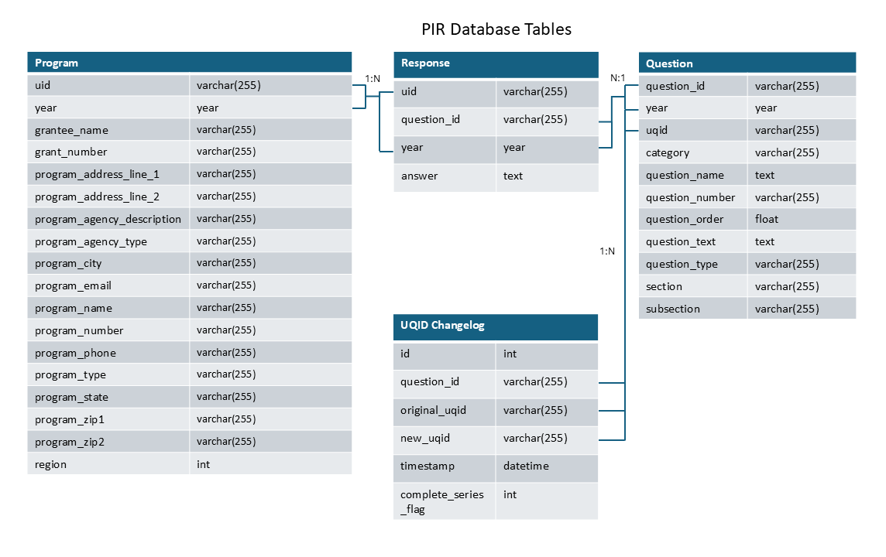

PIR Database
============

The PIR database consolidates the PIR data from 2008 - Present (2024 at
the time of writing) in a single database with the goals of improving
accessibility and facilitating analysis. Information about the
processing that raw data undergo before entering the PIR database can be
found in `workflow.md <workflow.md>`__.

Tables
------

Question
~~~~~~~~

.. csv-table::
	:file: ../csv/question.csv
	:header-rows: 1

Program
~~~~~~~

.. csv-table::
	:file: ../csv/program.csv
	:header-rows: 1

Response
~~~~~~~~

.. csv-table::
	:file: ../csv/response.csv
	:header-rows: 1

UQID Changelog
~~~~~~~~~~~~~~

.. csv-table::
	:file: ../csv/uqid_changelog.csv
	:header-rows: 1

Entity Relationship Diagram
~~~~~~~~~~~~~~~~~~~~~~~~~~~

   	PIR Entity Relationship Diagram

Views
-----

The following views are included with the PIR database: - Linked -
Includes all questions with a non-null UQID - Unlinked - Includes all
questions with a null UQID - Confirmed - Includes all questions ever
marked as confirmed - Unconfirmed - Includes all questions never marked
as confirmed

All linking views are mirrors of the *question* table. Refer to the
`Tables <#tables>`__ and `Data Dictionary <#data-dictionary>`__ sections
pertaining to the question table for additional details on the fields in
these views.

Data dictionary
---------------

.. csv-table::
	:file: ../csv/PIR Data Dictionary.csv
	:header-rows: 1